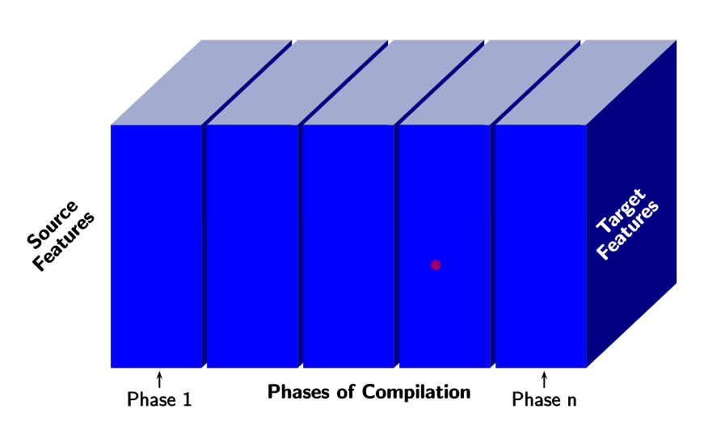

<!-- Notes Begin from here -->

**Retargetable Compiler** dies not require manual changes, the backend is generated according to the specifications. *the fuck*

A compiler essentially maps Source features to Target features through phases of compilation.

*problem with this?* To solve this, the target features were partitioned but there was no improvement. The source features were partitioned as well *ugh missed entire thing*

Finally, we partition the different "increments" of language to modularly increase the reach of the compiler.

*image*