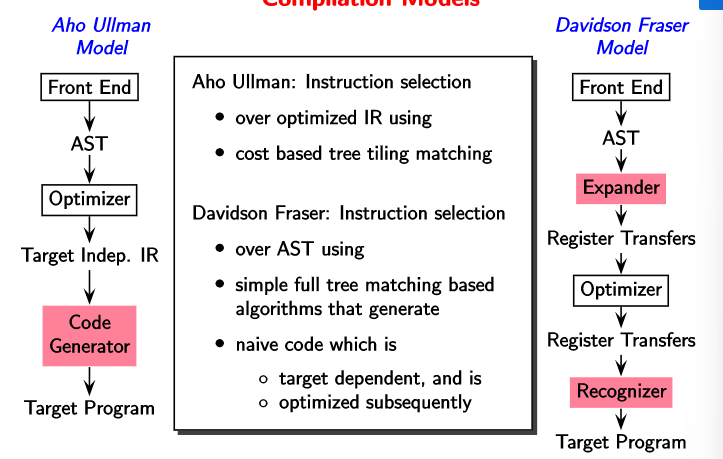
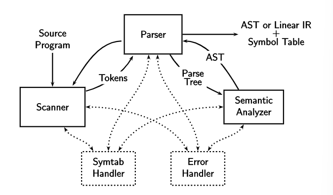
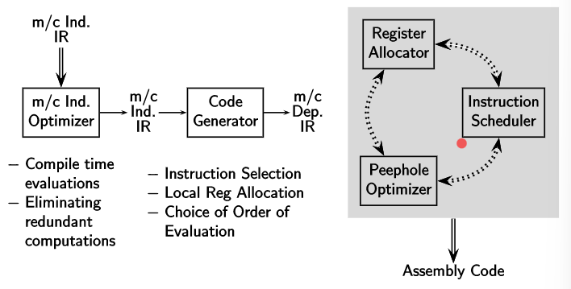
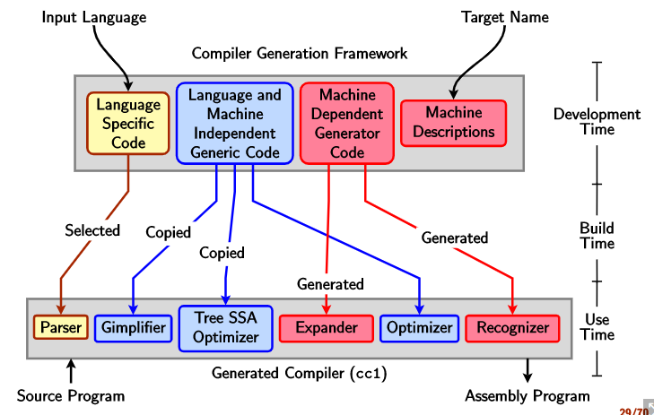

<!-- Notes Begin from here -->

There are two broad compilation models:

1. Aho Ullman Model
2. Davidson Fraser Model

Register Transfer is not 3-coded(?), and this means that dependence on machine's hardware is introduced very early on in the Davidson Fraser model.

GCC uses a modified Davidson Fraser Model, where (optimizer, target indep. IR) are present before the expander. This adds machine independent optimization.

&nbsp;

### Typical Front Ends

Scanner, parser and the semantic analyzer form a typical front end of a compiler. The flow of information generally has been shown in the following image.

### Typical Back Ends in Aho Ullman Model

Machine independent optimization is performed upon the IR before generating the code and performing machine dependent optimiation.

**Constant Propagation**: consider the lines `x=5;`, `y=10*x;` and let these be the only places where `x` comes into play. The compiler can then simply replace the second line with `y=10*5;` completely eliminating `x`. This is a compile-time optimization.

Register allocator allocates global registers, while code generator allocates local registers.

Instruction scheduler tries to find the best possible order of instruction execution.

Peephole optimizer ???

### GCC Framework

