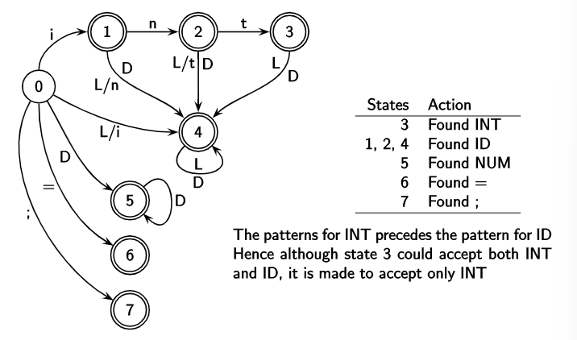
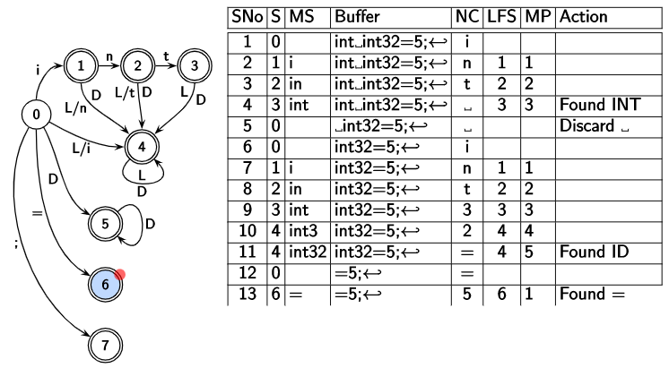

# Lexical Analysis


*Missed notes*


## Tokenizing the input using DFAs

We know that a DFA is defined by a five tuple, $(\Sigma,S,s_o,\delta,F)$. The decisions required to be made by a parser can be represented by a DFA as follows:



We would like to match the **longest** lexeme possible. We don't stop traversing the DFA once we hit a final state, we stop only when there is no transition or next character. The scanner keeps track of the following data:

| Step | State                              | Matched String                 | Buffer               | Next Character      | Last Final State                   | Marked Position                                    | Action                                   |
| ---- | ---------------------------------- | ------------------------------ | -------------------- | ------------------- | ---------------------------------- | -------------------------------------------------- | ---------------------------------------- |
|      | current state during DFA traversal | part of the string seen so far | stores entire string | next char in buffer | final state found during traversal | the position in matched string where LFS was found | "Found INT", "Discard space" for example |

Marked position is $-1$ when no final state is seen. When this occurs, we drop the first character in Matched String and start from the second state. That is, say we were scanning the word $\text{``dabc"}$ but the token is $\text{abc}$. We find nothing in our first pass over the string, upon which we drop $\text{d}$ at the start and scan the string again.

There are two things that might happen when no transitions are available:

- MP is -1, do the above mentioned thing. If the length of MS is 0, discard the current char and move to next. (Notice how space is discarded below)
- MP is not -1, so a lexeme is found and start from MP+1 and reset state to start; remove the lexeme found from buffer

A pass over the string `int int32=5;` using the above DFA looks like follows:




&nbsp;

This entire DFA can be represented using only 4 arrays, as `default` `base` `next` and `check`.

Essentially, each of the states is ranked, and each of the alphabet is also assigned a rank. `next` stores all the transitions, and `base` tells us where the transitions of a particular state start out. This is essentially the same as having a 2d array.

Now, we can remove all redundant transitions to save on space. `default` contains such transitions, and `check` is an array for seeing if the transition is present in `default` array or the `next` array. Note that the `check[state]=state` if transition is present in `next` array.

```python
# current state          : state
# input character        : character
# state after transition : next_state

def nextState(state, character):
    if check[state] == state:
        return next[ base[state] + character ]
    else:
        return nextState(default[state], character)
```

It is not guaranteed that the representation obtained this way would be minimal, but it is guaranteed that it would take less than $mn$ space.
