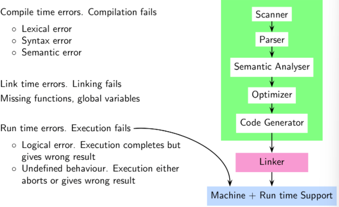
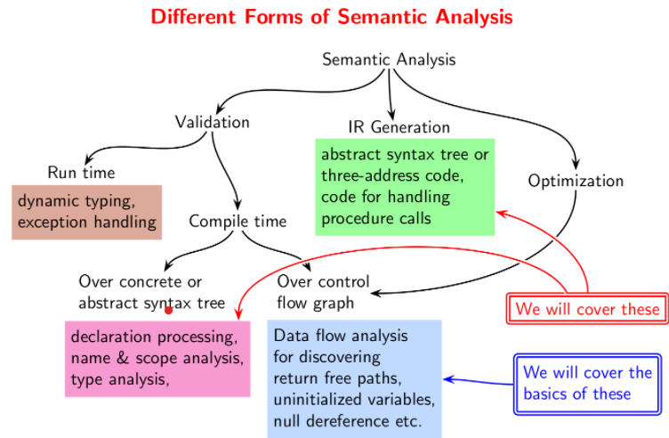
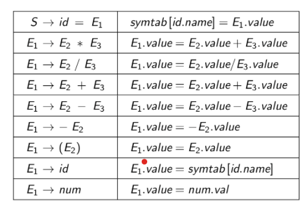
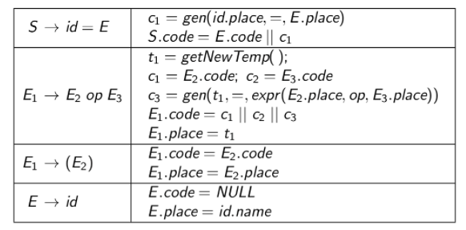

# Semantic Analysis

The constraints defining semantic validity cannot be described by CFGs. Therefore, a different approach is required to handle the semantic validity of a program. 

Using context sensitive grammars is horribly inefficient, so we instead use a **symbol table** to hold the names and information regarding variables. This table can be scanned later to check for constraints such as “A variable needs to be declared before it is defined” and the such.




An example of a semantic error found by the Optimizer would be “no return found on any control flow path”. Practical compilers give **warnings** for undefined behaviors. 




&nbsp;

## Syntax Directed Definitions (SDDs)

**Syntax Directed Attribute Evaluation** is used to define attributes of symbols and use them for semantic analysis.


$$
A\to\alpha\quad\vert\quad b=f(c₁,c₂\ldots cₖ)
$$


Here, $b$ is an attribute of $A$ and $cᵢ$ are attributes of the symbols in $\alpha$. Semantic rules are evaluated when the corresponding grammar rule is used for derivation (top-down parser) or reduction (bottom up parser).

Usually, we take attributes called `name`, `value` to be stored in a symbol table called `symtab`. Here, `name` refers to the variable’s name and the `value` attribute stores the current value of the variable. The table below shows how the semantic information is passed upwards in the tree. 




## Generating IR using SDDs

Consider the expression $x=(a-b)×(c-d)$. The desired output would be $t₀ = a-b, t₁ = c+d, t₂ = t₀×t₁, x=t₂$. The SDD corresponding to generating this IR is given below. We first construct the tree corresponding to the expression and apply the rules starting from the left.



Here, the IR code is stored in the `code` attribute of each of the nodes. Note that memorizing the SDD isn’t required as it is provided in the test.

==Order of traversal is important! We traverse the equation from the left to right, building nodes if they don’t exist!==

Similar to the basic operations, SDDs for ternary expressions and while loops also exist. They haven’t been mentioned here but they will be provided when required and are pretty intuitive. 

### SDD for Array Access

Consider the array $A[n_1][n_2]\ldots$. The starting offset of element $(i_1, i_2,\ldots i_n)$ would be given by the following computation:
$$
\text{Address} = ((\ldots((i_1\times n_2 + i_2)\times n_3 + i_3)\ldots)\times n_k+i_k)
$$
This can be computed by parsing $A[n_1][n_2]$ as $A_1[n_2]$ where $A_1 = A[n_1]$, and computing the values of offset and size incrementally.

### SDD for Field Accesses in a class

This can be done in two ways;

1. Access through offset in the struct (`int a = x.b;` is accessing through offset)
2. Access through a pointer to the field itself (`int a = x->b` is accessing the field using  pointer)

In the below code, space for accommodating `struct A` needs to be present, so the offset to access `int b` would be `4+sizeof(A)`. On the other hand, using a pointer instead would have an offset `4+4`. (assuming pointers are of constant size of 4 bytes)

```C++
struct myStruct{
    int a;
    struct A; // struct *A;
    int b;
}
```

&nbsp;

# Syntax Directed Translation Schemes (SDTS)

Given a production $X\to Y_1Y_2\ldots Y_k$, if an attribute $X.a$ is computed from those of $Y_i$ then $X.a$ is said to be a **synthesized** attribute. Similarly, if an attribute $Y_i.a$ is computed from $X$ or $Y_j$ then it is said to be a **inherited** attribute. (There is no constraint on $j$, yet)

Remember that we compute attributes from the left to the right. Therefore, if $1\leq j\leq i$ for a inherited attribute, then the SDD an be computed efficiently and concurrently. 

- **S-attributed**: SDD has only synthesized attributes
- **L-attributed**: SDD uses synthesized attributes or has inherited attributes that depend only on the symbols to the left

A **syntax directed translation scheme** changes the SDD so that it can perform actions mentioned in braces. The action to set the attribute $A.a$ is written at the end of the rule if $A$ generally. ==It is written before $A$ only when $A.a$ is an inherited attribute!== For example, consider the rule $Decl\to Type\text{ }Varlist$. We compute $Varlist.type$ by setting it to be $Type.name$, meaning it is inherited. Therefore, the SDTS for this would be the first statement given below. **take note of the last example!**
$$
\begin{align*}
Decl&\to Type\text{ }\{Varlist.type = Type.name\}\text{ }Varlist \\
Type &\to int\text{ }\{Type.name = int\} \\
Varlist &\to id \text{ }\{ id.type = Varlist.type \}
\end{align*}
$$


*marker non terminals causing reduce-reduce conflicts...*


# Name and Scope Analysis

There are two kinds of scoping methods, **static** and **dynamic**. Consider the following code, with the function call order being $main\to Q\to E\to R\to T$. The variables visible to $T$ under static scoping would be its local variables and all variables declared in lines written **above the function declaration**. Under dynamic scoping however, local variables and the variables in function calls before $T$ ($Q,E,R$) would be visible as well!

```C++
int main(){
    int a,x;
    void R(){
        int i;
        int T(){
            int m,n;
            // body of T               
        }
        // body of R
    }
    void E(){
        // body of E
    }
    void Q(){
        int s,x;
        int P(int y, int x){
            int i,j;
            // body of P
        }
        // body of Q
    }
}
```

