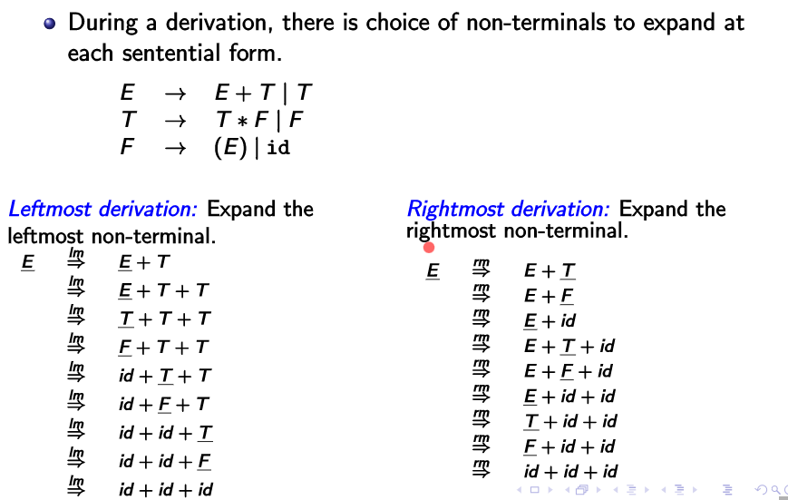

<!-- Notes Begin from here -->

Syntax analysis aims to discover the larger structures in a program. The tokens identified through scanning are analyzed to infer the relationships between them. These relationships are represented in the form of a **Parse Tree of (concrete) Syntax Tree**. An Abstract Syntax Tree is derived from this parse tree by the IR.

Parser ensures that the program is well formed by performing **syntax checking**. There are three places where a parser is placed in a compiler organization.

1. **Parse Driven Syntax Tree Generation** : The parser is works as an autonomous body, not concerned with other processes of a compiler
2.  **Parser Driven Frontend** : The frontend (scanner, semantic analysis) is interleaved with the parser
3.  **Parser Driven Compilation** : Entirety of compilation (scanner, semantic analysis, and code generation) is interleaved with the parser

Although parsers were originally written manually, we now have tools which can automatically generate parsers.

## Syntax Specification

The syntax of a program should be specified such that it is unambiguous, correct and complete, and convenient for both the designer and implementer. **Context Free Grammars** meet these requirements, and are thus used for syntax specification.

$$
G = (N,T,S,P)
$$

$N$ is a set of non-terminals, $T$ is a set of terminals, $S$ is a special nonterminal ($S\in T$) called the start, and $P$ is the set of production rules. A statement is obtained from the given set of rules via a **derivation**.

Its easy to generate a statement from a start state. However, our aim now is to ascertain whether a given statement belongs to a CFG. This is tough to do efficiently as we can’t simply just apply every rule without logic.

$$
\text{type idlist }\implies \text{ integer idlist, id;}
$$

Here, we say that `type idlist` derives `integer idlist, id;`.

| Symbol                     | Meaning                                 |
| -------------------------- | --------------------------------------- |
| $a\implies b$              | $a$ derives $b$ in a single step        |
| $a\overset{*}{\implies} b$ | $a$ derives $b$ in a zero or more steps |
| $a\overset{+}{\implies} b$ | $a$ derives $b$ in a one or more steps  |

### Sentential Forms

A string $\alpha\in (N\cup T)^{\*}$ that is derivable from the start state itself is called a **sentential form** of the CFG $G$. That  is, $S\overset{\*}{\implies} \alpha$ . Note that every sentence is a sentential form but not the other way around. 

> A sentential form is “on its way” towards becoming a sentence

### Leftmost and Rightmost derivations

Denoted by $a\overset{lm}{\implies} b$ and $a\overset{rm}{\implies} b$ respectively. Leftmost derivation is when the leftmost non terminal string is expanded upon. Similarly for rightmost.

A *parse tree* is a pictorial form of representing a derivation. The root of the tree is labeled with the start state ($S$), and each of the leaf nodes is labeled with a terminal or $\epsilon$. The derivation of a parse tree is given by reading its leaves left-to-right.

### Ambiguous Grammars

A grammar is said to be ambiguous when more than one parse tree exists for a derivation. (implying that more than one leftmost, rightmost derivations exist) Note that this is a property of the grammar and not the language itself.

Ambiguities are eradicated via:

- Precedence
- Associativity

&nbsp;

# Parsing Strategies

“Parsing” refers to the technique of building the parse tree. This can be done bottom-up or in a top-down manner. We shall be looking at bottom-up parsing in this course. Note that we usually work from the left to the right, constructing the parse tree from the bottom up. This implies that the resulting decoded derivation would be *Rightmost* in nature.

**Handle** - A right-sentential form $\gamma$ such that there exists a production rule $A\rightarrow\beta$ and $\beta$ is a substring of $\gamma$.

We shall assume that we know how to detect handles in a string, and proceed with parsing algorithms. Note that only terminals can appear after $\beta$ in $\gamma$ as it is the right sentential form.

## SLR(0) Parsing

There are 4 basic actions of the shift-reduce parser;

1. **Shift** - We move a single lexeme from the input buffer onto the stack until the appearance of a handle
2. **Reduce** - Upon noticing a handle, it is popped and replaced with the LHS of the corresponding production rule
3. **Accept** - The parser accepts the string when the input buffer is empty and the start symbol $S$ is the only symbol present on the stack
4. **Error** - An error is thrown in all other cases, with the string being rejected

This method is also called as LR(0) parsing. Note that $ is used to represent the bottom of the stack and the end of the input buffer string.

Two types of conflicts are possible here:

1. **Shift-Reduce Conflict** - Consider the input $β a\gamma$ with the rules being $A\to\beta$ and $B\to β a \gamma$. 2 options present; either accept the first rule and reduce, or go for the second rule and shift.
2. **Reduce-Reduce Conflict** - Let the stack be $β\gamma$ with rules $A\to\beta\gamma$ and $B\to\gamma$. Again, 2 options present; either reduce using the first rule or using the second rule.

## SLR(1) Parsing

The only difference between SLR parsing and LR parsing is the parsing table. Follow the given parse table blindly for now. An example of the table is given below.

Now, we shall look at ways to construct this table to be able to “formalize” shift-reduce parsing. Firstly, make sure to take note of precedence and associativity rules inherent in the grammar. (That is, $a+b+c$ would be expanded as $(a+b)+c$, and $a+b\*c$ would be expanded as $a+(b\*c)$)

*Viable Prefix* - A prefix of the right sentential form that doesn’t extend beyond the current handle. It is either a string with no handle, or a string that ends with a handle.

The set of viable prefixes forms a regular language, and can be recognized as by DFA. Coupled with the stack recognizing handles that shift reduce parsing keeps track of, it is possible to define a PDA for this.

Consider the following set of rules, with the aforementioned rules of precedence and associativity.

$$
\begin{align*}
E&\to E+E\\
E&→ E*E\\
E&→ \text{id}\\
\end{align*}
$$

A “tree” is constructed to generate all viable prefixes, from the most basic case ($\epsilon$). Remember that a handle doesn’t necessarily need to be reduced once it is noticed, it is possible that the next token prioritizes shifting. Example, $E+E*E$ 

#### Valid items for viable prefixes

An item is a production with a $\cdot$ somewhere in the RHS. The dot $\cdot$ separates what has been seen from what may be seen in the input. We guess these from the rules that define the language.

A **complete item** has $\cdot$ at  the end, and suggests a reduction. The valid items for a few expressions is given below.

For $\epsilon$, 
$$
\begin{align*}
	E&\to\cdot E+E\\
	E&\to\cdot E*E\\
	E&\to\cdot \text{id}\\
\end{align*}
$$
For $E$,
$$
\begin{align*}
	E&\to E\cdot+E\\
	E&\to E\cdot*E
\end{align*}
$$

For $E+$; $\cdot E$ is called a **Kernel Item** and the other computed results are called **Closure Items**
$$
\begin{align*}
	E&\to E+·E  \\
	\\
	⇒ E&\to E+·E+E \\
	E&\to E+·E*E \\
	E&\to E+·\text{id}
\end{align*}
$$

#### Computing LR(0) item sets for grammar

1. **Add a new start state** $E'$ which points to the original start state. The start state of the DFA is constructed by putting a dot before the original start state, and take its closure. ($E'→· E$)
2. For all the states remaining which have a rule of form $· E$ where $E$ is a non terminal, take its closure and make a new state. Link back if such a state has been previously created. Repeat this step until all states’ rules have been dealt with.

 

Certain transitions are removed from this to enforce associativity and precedence. (For example, + from $I_5$)

#### First and Follow Sets

$\text{FIRST}(\beta)$ contains the **terminals** that may begin a string derivable from $\beta$. If $\beta$ derives $\epsilon$, then $\epsilon\in \text{FIRST}(\beta)$.

Consider the rule $A\to X_1\ldots X_k$. Obviously, $\text{FIRST}(X_1)\subseteq \text{FIRST}(A)$. If $A$ could derive $\epsilon$ (that is, if $\epsilon\in\text{FIRST}(X_1)$), then we could also say that $\text{FIRST}(X_2)\subseteq\text{FIRST}(A)$. (and if $X_2$ derived $\epsilon$ we say the same thing about $X_3$ and so on)

$\text{FOLLOW}(A)$ contains the **terminals** that follow $A$ in some right sentential form. If $A$ is the start symbol, then $\$\in\text{FOLLOW}(A)$.

Consider the rule $A\to\alpha B\beta$. It can be said that $\text{FIRST}(\beta)-\{\epsilon\}\subseteq \text{FOLLOW}(B)$ (obviously!). Moreover, if $\beta$ can derive $\epsilon$ then $\text{FOLLOW}(A)\subseteq\text{FOLLOW}(B)$ (also obviously because $B$ is the rightmost variable in this derivation). 

#### Creating the Parsing Table

1. Create the $LR(0)$ item sets’ DFA as explained earlier

2. For all the non-terminals in the (new) grammar, compute the $\text{FOLLOW}$ set

3. Create a table with the rows labeled as state numbers from the DFA and columns labeled as all the tokens encounterable (including \$)

4. For every state, do the following;

   1. transition using terminal to state $n$ - $sn$

   2. transition using non-terminal to state $n$ - $cn$

   3. $\cdot$ is present at the end of item (a thing has been derived) - $rn$ for all the things in the $\text{FOLLOW}$ set, $n$ is the rule to be applied for reducing

      For example, $E'\to E\cdot$ would have $acc$ in \$ because $\text{FOLLOW}(E')=  \{\$\}$

($I_6$ doesn’t have the + edge, its a typo)

## CLR(1) / LR(1) Parsing

Although SLR(0) worked well, it fails at times because a symbol in a $\text{FOLLOW}$ set need not follow the variable in **every** right sentential form. LR(1) sets are constructed to consider the lookahead symbol as well. 

The “1” in LR(1) stands for the first level of look-ahead that the sets use. A subset of the LR(0) is constructed.

Rules are of form $A\to \alpha\cdot\beta,a$ meaning that the rule is valid when $A$ is followed by $a$. The closure computation for a rule $A\to\alpha\cdot B\beta,a$ would be given by items of form $B\to\cdot\gamma,\text{FIRST}(\beta a)$. The lookahead is not changed on transitions, however. That is, transitioning on $B$ in the previous rule would yield $A\to\alpha B\cdot\beta, a$.

Generating the table is exactly the same as the SLR(1), except at the reduce step. Instead of looking at the $\text{FOLLOW}$ sets, we look at the look-ahead for the corresponding reduction in the DFA and reduce only for those terminals. 

## LALR(1) Parsing

Stands for “Look Ahead LR(1)” parsing. Idea is to merge item sets with identical cores which may have different lookaheads. That is, $A\to\alpha, a$ and $A\to\alpha,b$ are merged to be $A\to\alpha,a/b$. ==This can introduce reduce-reduce conflicts but never introduce shift-reduce conflicts.==

Note that we do not construct LR(1) sets and merge for LALR(1). Instead, we can just construct LR(0) sets and use a lookahead propagation algorithm.

The expressive power of parsing is
$$
\text{SLR(0)} <\text{SLR(1)} <\text{LALR(1)} <\text{LR(1)}
$$
