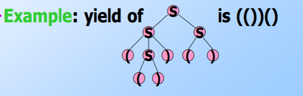
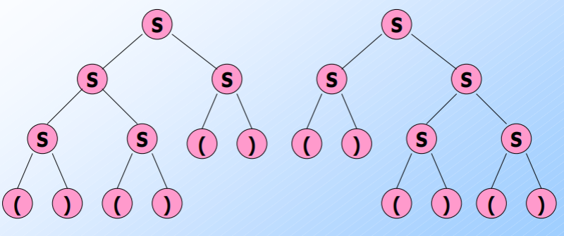
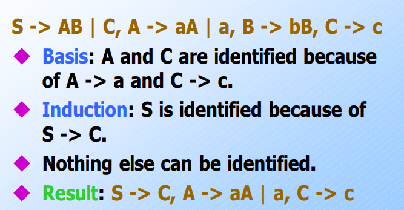
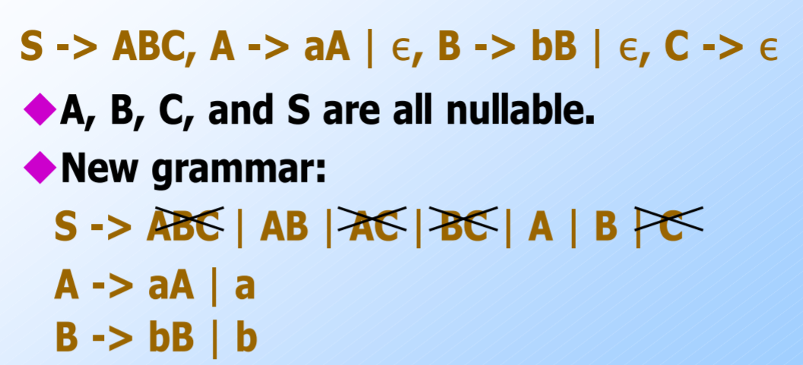

<!-- Notes Begin from here -->

This is a methodology for representing languages. It is more powerful than DFAs and RE, but is still not enough to define all the possible languages. The basic idea is to use “variables” as stand-ins for sets of strings.

Formally, the terms described below define a CFG.

$$
G = (V,\Sigma, R,S)
$$

- **Terminals** ($V$)- The symbols of the alphabet
- **Variables / Non terminals** ($\Sigma$) - A finite set of other symbols
- **Start Symbol** ($S$)- The variable whose language is being defined
- **Production** ($R$)- A rule of the form “$\text{variable} \rightarrow \text{variables} ∪ \text{terminals}$“

“Productions of A” refers to the set of all strings that are *derivable* from $A$ using the rules defined by the CFG. A string $\gamma$ is said to be derived from $\alpha$ iff the application of a rule results in $\gamma$. This is represented as $\alpha\implies\gamma$.

Derivation using 0 or more steps is represented by $\overset{*}{\implies}$.

Any string derived from the start string is called as a **Sentential Form**. It essentially is a string “on its way” to becoming part of the language.

{: .notice--info}

A language defined by a CFG is called as a Context Free Language.

### BNF Notation (Backus-Naur-Form)

This is a method of representing the rules of CFG in a programming way.

| CFG Part                          | BNF Representation                           | Example                                  |
| --------------------------------- | -------------------------------------------- | ---------------------------------------- |
| Variable                          | \<word\>                                     | \<statement\>                            |
| Terminals                         | multicharacter strings in bold or underlined | while, **while**, <u>while</u>           |
| $\rightarrow$ in rule definitions | $::=$                                        | \<state\> ::= a                          |
| “or” in rule definitions          | $\vert$                                      | \<state\> ::= a$\vert$b                  |
| (not) Kleene Closure ($a^+$)      | “...”                                        | \<state\> ::= \<\state>...               |
| Optional Elements                 | [...]                                        | \<state\> ::= \<statea\> [or \<stateb\>] |
| Grouping $(ab)^*$                 | {...}                                        | \<state\> :== {\<statea\>\<stateb\>}..   |

### Leftmost and Rightmost derivations

A problem with CFGs is that every word may have more than one derivations possible. This makes verification and confirmation difficult. A derivation is said to be “Leftmost” when only the leftmost non-terminal is operated on in every step of the derivation. The same definition works for rightmost derivations as well.

&nbsp;

# Parse Trees

Trees whose nodes are labeled by the symbols of a particular CFG. The leaves are labeled by terminals or $\epsilon$, Interior nodes by variables and the root by the start symbol.

The **yield** of a parse tree is given by concatenating the leaves in a left-to-right order. (The order of preorder traversal)

> For every parse tree, there is a unique leftmost derivation. Conversely, for every leftmost derivation, there is a unique parse tree with the same yield.

The forward part can be proven using strong induction on the height of parse tree, and the backwards part can be proven using strong induction on the length of the derivation. Also, it can be seen from the proof that obtaining a parse tree doesn’t depend on the derivation being “leftmost”.

> For any derivation, there exists a unique parse tree with the similar yield.

### Ambiguous Grammar and LL(1) Grammar

Leftmost and Rightmost derivations had been introduced to alleviate confusions caused by multiple derivations. However, it is not guaranteed that a unique leftmost (or rightmost) derivation exists for a given string.

For example, consider grammar with the following rule. Two parse trees exist for the string “()()()”

 

$$
S\rightarrow SS\vert (S)\vert ()
$$
 

From the theorems discussed earlier, it can be concluded that two leftmost and rightmost derivations would exist for this grammar. This is thus called **Ambiguous Grammar**.

Note that ambiguity is a property of the grammar, and not the language itself. That is, we can write equivalent unambiguous grammar for the above example.

$$
\begin{align*}
B \rightarrow &(RB\vert\epsilon \\
R \rightarrow &)\vert (RR
\end{align*}
$$

Grammar such as the above example, where we can figure out the production to use in a leftmost derivation by looking at the string left-to-right and looking at the next one symbol is called $LL(1)$ grammar. **L**eftmost derivation, **L**eft-to-right scan, **1** symbol of lookahead.

$LL(1)$ grammars are never ambiguous. {: .notice--info}

Note that some languages are **inherently ambiguous**, meaning that there does not exist an unambiguous grammar that accepts the CFL’s language. For example, $\{0^i1^j2^k\vert i=j\text{ or }j=k\}$ is inherently ambiguous. This can be understood intuitively by looking at $0^n1^n2^n$, which could have been obtained from either the first check or the second check.

&nbsp;

## Eliminating Useless Symbols

Useless symbols are of two kinds:

1. Symbols which do not derive a terminal string
2. Symbols which are not reachable from the start

We shall look at methods for elimination of such symbols.

### Eliminating Symbols which do not derive a terminal string

Consider the following set of rules:

$$
\begin{align*}
S&\rightarrow AB \\
A&\rightarrow aA\vert a\\
B&\rightarrow AB
\end{align*}
$$

It can be said that $S$ derives nothing and the language is empty. The algorithm for deducing this is quite simple and is based on induction.

#### Algorithm

**Basis** - If there is a production $A\rightarrow w$ where $w$ is composed of terminals, then $A$ derives a terminal string

**Induction** - If $A\rightarrow \alpha$ and $\alpha$ consists only of terminals and variables known to derive terminals, then $A$ derives a terminal string.

For a given set of rules, we perform the above induction and mark all the variables which generate a terminal string. We can then remove all the rules which include a variable which has not been marked.

### Eliminating Unreachable Symbols

The symbols which are unreachable from the starting symbol are said to be *unreachable*. We can remove all rules which involve such strings as they are not relevant. The algorithm for removing unreachable symbols is similar to the algorithm for eliminating the symbols that do not derive a terminal string;

- Mark the start state, and iterate by marking all the variables that are derivable by the start state
- Rules involving unmarked states can be eliminated

### Epsilon Productions

A production of the form $A\rightarrow \epsilon$ is said to be an $\epsilon$-production.

> If L is a CFL, then $L-\{\epsilon\}$ has a CFG with no $\epsilon$-productions.

A variable $A$ is said to be **nullable** when it can derive $\epsilon$ in a finite number of steps. That is, $A\overset{*}{\implies}\epsilon$. Eliminating nullable variables uses the same algorithm discussed earlier. Variables of form $N\rightarrow \epsilon$ are marked, and induction is performed. A variable $B\rightarrow\alpha$ is nullable iff all variables in $\alpha$ are nullable as well.

However, we cannot simply remove all rules which the nullable symbols are involved in. The following steps have to be followed:

- Remove all direct $\epsilon$ transitions ($N\rightarrow \epsilon$)
- Replace nullable variables on RHS of a rule with two cases, one unchanged and one with it being removed

Example:

### Unit Productions

A production whose right side consists of exactly one **variable** is called a unit production. This is redundant and can be eliminated. That is, if $A\overset{*}{\implies}B$ by a set of unit productions and $B\rightarrow\alpha$ is a non-unit production; we can drop all the unit productions and just add $A\rightarrow\alpha$. 

&nbsp;

# Chomsky Normal Form

> **Theorem**
>
> If $L$ is a CFL, there exists a CFG for $L-\{\epsilon\}$ that has:
>
> 1. No useless symbols
> 2. No $\epsilon$ productions
> 3. No unit productions

A CFG is said to be in CNF iff every production in the grammar is one of these two forms:

1. $A\rightarrow BC$ (RHS is two variables)
2. $A\rightarrow a$ (RHS is a terminal)

> **Theorem**
>
> If $L$ is a CFL, there exists a CNF for $L-\{\epsilon\}$

&nbsp;

# Pumping Lemma for CFL

The statement of the pumping lemma is as follows.

> For every context-free language $L$ there exists an integer $n$, such that for every string $z$ in $L$ such that $\vert z \vert\geq n$ it can be written as $z = uvwxy$ such that:
>
> 1. $\vert vwx \vert \leq n$
> 2. $vx>0$
> 3. For all $i\geq 0, uv^iwx^iy\in L$

This extended pumping lemma can be used to prove that $L= \{ 0^i10^i10^i\vert i\geq 1 \}$ is not CFL in nature.

##### Proof

Let $n$ be the corresponding constant for $L$. Consider the string $0^n10^n10^n$ which belongs to $L$. There are two cases for $v,x$.

1. $v,x$ contain no $0$s. This implies that they contain at least one $1$, implying that $uv^iwx^iy$ has more than two $1$s and thus is not in the language.
2. $v,x$ contains at least one $0$. Because $\vert vwx\vert \leq n$, it is too short to extend to all the three blocks, and is localized to the middle block. Therefore, $uv^iwx^iy$ would not have equal number of $0$s in all blocks and is thus not in the language as well.

Shown that $0^n10^n10^n$ is cannot satisfy Pumping Lemma in mutually exclusive and exhaustive cases. Therefore, $L$ is not a Context-Free Language and cannot be represented by a CFG.
