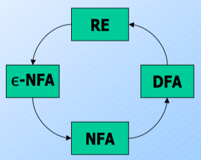

# Regular Expressions

Inductively describe languages. If $E$ is a regular expression, $L(E)$ is the language that it describes.

|         Basis Definitions          |      Inductive Definitions       |
| :--------------------------------: | :------------------------------: |
| If $a$ is any symbol, $L(a)=\{a\}$ | $L(E_1+E_2) = L(E_1)\cup L(E_2)$ |
|    $L(\epsilon) = \{\epsilon\}$    |    $L(E_1E_2) = L(E_1)L(E_2)$    |
|        $L(\phi) = \{\phi\}$        |       $L(E^*) = (L(E))^*$        |

Order of precedence: $* > \text{concatenation} > +$

==Regular Expressions are equivalent to Deterministic Finite Automatons (NFAs, $\epsilon$-NFAs by extension as well)==

*DFAs to regular expressions is blurry, revise!*

