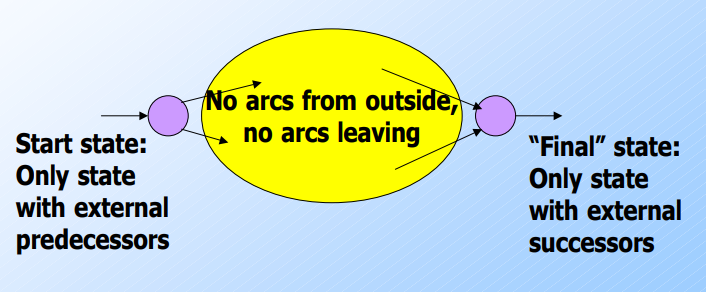
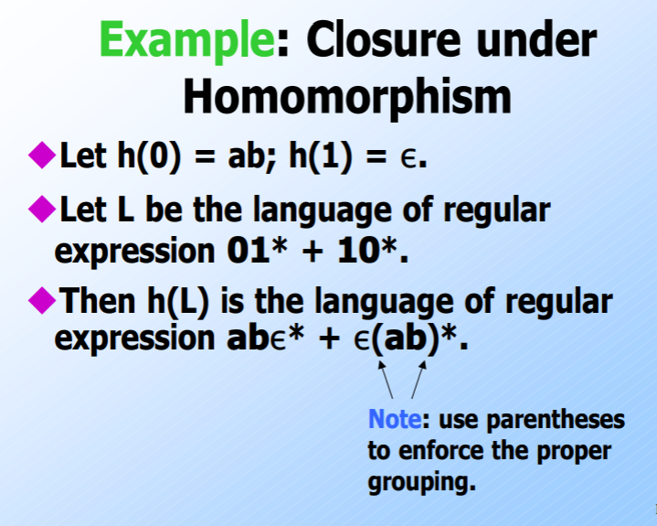
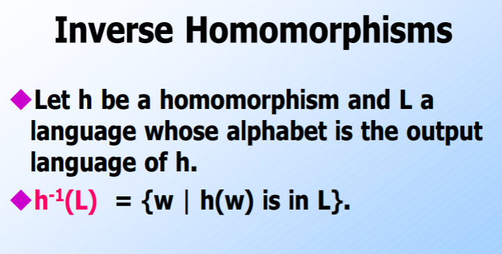
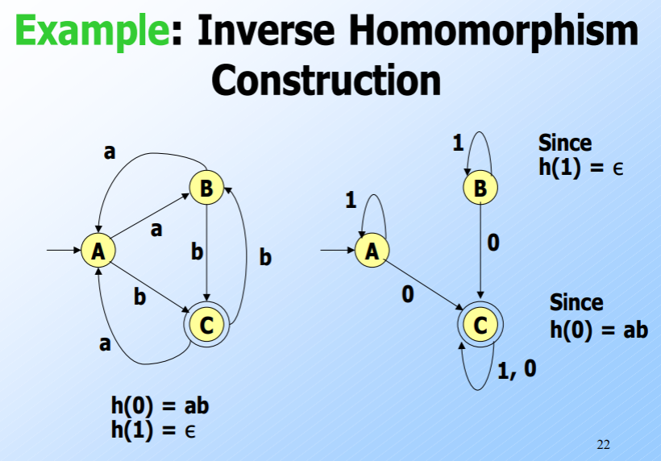
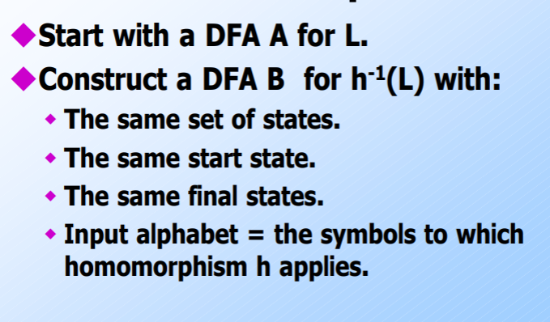
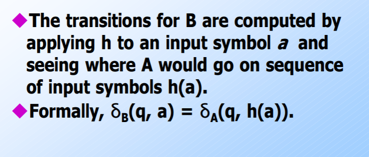

# Regular Expressions

Inductively describe languages. If $E$ is a regular expression, $L(E)$ is the language that it describes.

|         Basis Definitions          |      Inductive Definitions       |
| :--------------------------------: | :------------------------------: |
| If $a$ is any symbol, $L(a)=\{a\}$ | $L(E_1+E_2) = L(E_1)\cup L(E_2)$ |
|    $L(\epsilon) = \{\epsilon\}$    |    $L(E_1E_2) = L(E_1)L(E_2)$    |
|        $L(\phi) = \{\phi\}$        |       $L(E^*) = (L(E))^*$        |

Order of precedence: $* > \text{concatenation} > +$

==Regular Expressions are equivalent to Deterministic Finite Automatons (NFAs, $\epsilon$-NFAs by extension as well)==

To prove the equivalence between RE and Finite State Automatons, we show the following:

- Show that for every RE, there is an automaton that accepts this RE’s language. We pick the  most accepting automaton, the $\epsilon$-NFA.

  It can be easily shown via induction that such an NFA can be constructed.

   

- For going backwards, use the the following method to find the corresponding RE. We use a DFA here as it is the most “restrictive” automaton.

  [GFG Url](https://www.geeksforgeeks.org/generating-regular-expression-from-finite-automata/)

&nbsp;

## Decision Properties of Regular languages

A set of languages is called as a Language Class, and Language classes have two kinds of properties, **closure** and **decision**. We will be focusing on decision properties for now.

**Decision Property** for a class takes the formal description of a language to see if a property holds. (Formal description - using DFA)

**Closure Properties** are used to prove if a language is regular or not. For example, $L_1=\{0^n1^n\}$ is not a regular language. However, proving $L_2=\{\text{equal number of 0's and 1's}\}$  to not be regular is tougher. Closure can be used as follows, if $L_2$ was regular, then RHS should be regular as well (contradiction!)
$$
L_2 \cap L(0^*1^*)= L_1
$$
==**Pumping Lemma** is used to show that $a^nb^n$ cannot be expressed by a DFA.==

*Membership problem* is checking if a word $w\in L$. The problem is said to be **decidable** iff the algorithm used for solving it has the following two properties:

1. **Soundness**: The algorithm is correct
2. **Terminate**: The algorithm terminates in finite time

A list of problems that we will be dealing with in this course are given in the table below. The methods to solve the problems have been discussed further below the table.

| Problem       | Question                                                     |
| ------------- | ------------------------------------------------------------ |
| Emptiness     | $L=\phi$ ?                                                   |
| Infiniteness  | Is $L$ infinite?                                             |
| Containment   | Given $L,M$ is $L \subseteq M?$                              |
| Minimality    | Can a DFA with smaller states accept the same language? (use distinguishable states) |
| Membership    | Is $w\in L$?                                                 |
| Equivalence   | Are $L_1$ and $L_2$ equivalent?                              |
| Impossibility | Show $L$ cannot be accepted by any DFA (Pumping Lemma)       |

&nbsp;

## Infiniteness Property

If the DFA has $n$ states, and the language contains any string of length $n$ or more, then the language is infinite. Otherwise, the language is surely finite. (Proof using the pigeon-hole principle)

### Pumping Lemma

For every regular language $L$ there exists an integer $n$ such that every string $w$ in $L$ of length greater than $n$, we can write $w = xyz$ such that

1. $\vert xy \vert < n$
2. $\vert y \vert>0$
3. $\forall i\geq0, xy^iz\in L$

This is closely related to the infiniteness algorithm we stated earlier. $y$ is the pert of the DFA which has a loop, and can thus be infinitely “pumped” to keep generating new strings.

We can now prove that $\{0^k1^k\}$ is not a regular language. Assume it was, and let the integer be $n$. Consider the word $0^n1^n$ written as $xyz$. Because $\vert xy \vert<n$, $y$ is made up fully of $0's$. Therefore, $xy^iz$ does not belong in $L$ as the number of $1's$ and $0's$ would not be equal.

 &nbsp;

## Equivalence Algorithm

Given two DFA’s, take the cross-product between them. $(q,r)$ is a final state of this DFA iff **exactly one** of the two is a final state in its original DFA. That is, this new DFA accepts $L_1\oplus L_2$. If they were equivalent, then this new DFA would not accept any states. 

**Containment Algorithm** is exactly the same, except that we search for words accepted by $L$ and not by $M$.

&nbsp;

## Minimality Algorithm

Create a table containing pairs of all states in the DFA. Two states are said to be **distinguishable** if there exists a string which takes exactly one of the two to a final state. We can use induction using this property.

1. Mark all pairs where exactly one is the final state (basis)
2. Mark all pairs where a letter takes exactly one of the two to a previously marked state
3. Remove states unreachable from the start state

It can be proven using induction/contraction that the DFA obtained using this method is **THE** minimal DFA.

&nbsp;

# Closure Properties of Regular Languages

Closure properties are used to know if a the result of an operation on a given set of languages also belongs to the same set.

The following operations are closed under the set of regular languages.

|    Operation    |    Notation    |
| :-------------: | :------------: |
|      Union      |   $L\cup M$    |
|  Concatenation  |      $LM$      |
| Kleene Closure  |     $L^*$      |
|  Intersection   |   $L\cap M$    |
|   Difference    |     $L-M$      |
| Complementation | $\Sigma^* - L$ |

Lets look at a new operation called **Reversal**, and discuss the closure under this operation.

### Closure under Reversal

Given a language $L$, $L^R$ is the set of strings whose reversal is in $L$. That is, if $abc\in L$, then $cba∈ L^R$. We shall prove this using the regular expression $E$ for the language $L$ to obtain $E^R$.

- **Basis** - If $E$ is a symbol, $\epsilon$ or $\phi$ then $E^R = E$
- **Induction**
  - $(F+G)^R = F^R+G^R$
  - $(FG)^R = G^RF^R$
  - $(E^*)^R = (E^R)^*$

This method can be used to solve that problem where we wanted to find the DFA of all binary strings which when reversed were divisible by 8.

### Closure under Homomorphism

Homomorphism refers to the application of a function $h$ which essentially replaces alphabets in the language.

Similarly, inverse homomorphisms are closed under the domain of regular languages as well.

