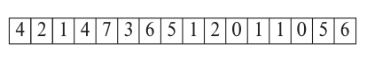
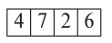
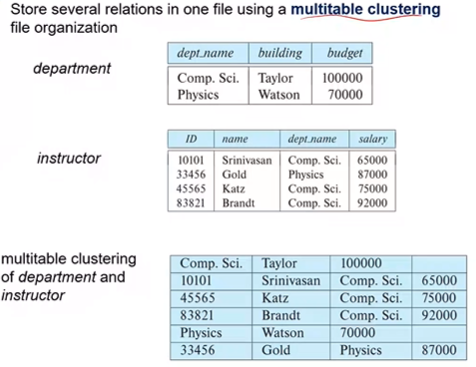
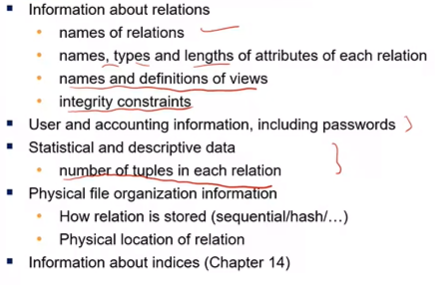
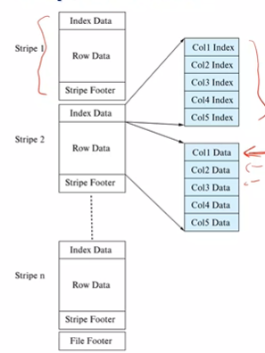

# 13. Data Storage Structures

The order of storage abstraction is: Database -> files -> records -> fields

Our assumptions:

- Record size is fixed
- Each file has records of one type
- different files used for different relations
- Records smaller then a disk block

Fixed length records can be handled easily, like an array. The $i$th entry is stored starting from byte $n\times(i-1)$ where $n$ is the size of each record. This may cause crossing of blocks which isn’t ideal, so we go to the next block if the remaining space isn’t enough to store a single record.

The empty space generated upon deleting records is linked using a **free list**. (Do not “move” all the rows below it as it is very inefficient!) So we first look at the free list when trying to add a record, and create a new block if the space given by the free list is insufficient.

### Variable Length Records

Store a pair $(\text{offset, attribute length})$ instead of the variable length attribute. Fixed length attributes are stored directly. The actual data of the variable length records is stored AFTER the null-bitmap row is stored. That is, a bit corresponding to the particular attribute would be set to 1 if it was `null`. **NOTE THAT THE NULL BITMAP IS OF 1 BYTE, AND EACH PAIR IS 4 BYTES!**

The example below is a snapshot of the schema `(varchar, varchar, varchar, int)`

Variable length records cause **fragmentation** of the memory, so better memory management is needed in each block. A **slotted page structure** is used for this purpose.

### Slotted Page Structure

`#entries` stores the number of entries and the size of each entry. (Note that it need not be indexed in order, given in the example above) Records can be moved to make the free space contiguous. The blocks are always filled in a **bottom-up** manner. No pointers are allowed to the records directly to ensure that the block header has complete autonomy over the records’ position. A user can only index into the Block Header to access the records.

#### Handling Large Files

Assume $A$ is an attribute which has a very large file size that makes the record size exceed that of the page. We handle this by breaking the attribute into $n$ smaller parts and storing the $i^{th}$ fragment in a separate relation as $r_A = \{ fid, i, \text{<fragment>} \}$ where $fid$ is the fragment id, and this is stored in the original relation. The file can thus be reconstructed. 

&nbsp;

## File Organization

**Heap** - Place a records anywhere you find space

**Sequential** - Sort the records based on a `search` key, so that finding data is easier. Not good for large databases $\mathcal{O}(n\log n)$

**B+ Tree** has ordered storage with both inserts and deletes, and **Hashing** on the search key might specify the block where the record needs to be placed.

These organization methods are explored in detail below.

### Heap 

> Where the fuck do I store my data?

Searching the entire heap for free space is very bad, so we use a free space map. It is an array which stores the approximate percentage of free space in a given block. A “Second Level Bit Map” would then store the maximum free space available in sets of $n$. ($n=4$ in the example below)

This free space map is written to the disk periodically. However, notice that updated need not necessarily change the map values; meaning that **it is okay** to store old values. We would have to keep updating the data periodically to ensure that they aren’t largely out of sync.

#### Sequential File Organization

Note that they need not be sequential physically, but a linked list of pointers is ordered sequentially. (So much for $\mathcal{O}(\log n)$ search I guess, whats the point of a linked list) Reorganization of data takes time, but writing is very easy. Note that the linked list may point to entries in a different block too!

#### Multitable clustering File Organization

Several relations are stored in a single file.

&nbsp;

## Metadata

The **Data Dictionary** (System Catalog) stores Metadata; which consists of 

A system’s metadata can be represented using a relational schema, akin to how we represented relations between relations in a database.

## Table Partitioning

**Horizontal Partitioning** refers to records being stored in separate relations. This is usually done at the physical layer. Also note that queries must be run on all the partitions to give a result.

**Vertical Partitioning** has columns stored separately. This is called as **columnal representation** or **column oriented data**. Compression is possible as column values tend to be quite similar (consider the column `year` for example). It also has improved Cache performance , and enables **Vector Processing** on modern CPUs. This is used when there is not much IO happening (as reconstructing rows for insert/update/delete is expensive).

### Columnar File Representation

Big Data Applications have very large size files, hence columnar compression is used. ORC and Parquet are popular formats. In ORC, the file is divided into chunks and each chunk is stored in **stripes** in a columnar manner. Each stripe has three parts:

1. **Index Data** acts like the header and contains the indexes for the data
2. **Row Data** which contains the data in a columnar manner
3. **Stripe Footer**

Columnar representation can be used in main memory too without a buffer manager. *????*

&nbsp;

# Storage Access

**Block** is a unit of storage and data transfer. **Buffer** is a portion of the memory to store copies of the disk, and is handled by the **Buffer Manager**.

**Pinned Block** is not allowed to be written back to the disk, is essentially locked. We pin a block before reading/writing data and unpin when the operation is done. A pin count is maintained, and buffer block is evicted iff pin count is 0. Moreover, readers get a **shared lock** where as writers get an **exclusive lock**.

### Buffer Replacement Strategies

**LRU** is the simplest replacement strategy where a stack is used. **Toss-Immediate** releases the block as soon as the final tuple of the block is processed. **MRU** uses statistical information and evict the least probable blocks. 

**Non-volatile write buffers** has blocks being written to a NV-RAM/Flash buffer first, and copying the data from there. This ensures that a power loss doesn’t result in the data being lost. Such file systems are called **Journaling filesystems**.
