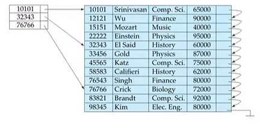
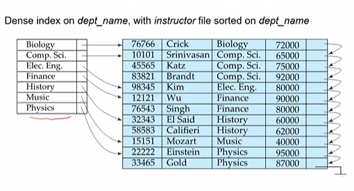
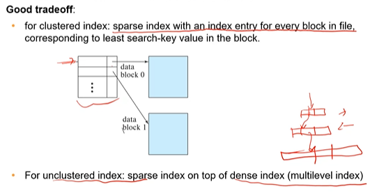

# 14. Indexing

Indexing mechanisms are used to speedup accesses to desired data.

**Search Key** is an attribute used to look up records. An **index file** consists of entries of form $\text{<search-key, pointer-to-record>}$. Note that binary tree is a very bad idea due to its large size. 

There are 5 main metrics to evaluate an index: Efficiency, Access time, insertion time, deletion time and space overhead.

## Ordered Indices

Index entries are stored in a sorted manner on the search key value. The index which specifies the order of the records is called the **clustering index** or the **primary index**. The search key of the primary index need not be the primary key. Other indices are called **secondary indices**.

A index is said to be **dense** if it appears for every search-key value in the file. **Sparse index** on the other hand contains records for only some search key values. We find the largest search key with value $<K$ and then search sequentially.

(*something in the previous slide about how dense need not have entry per record?? in the below pic*)

*Skipped multilevel indexing, make notes on it!*

## B+ Tree Indexing

No duplicates is assumed. Each node can have varying number of children. 