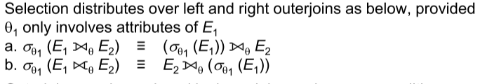
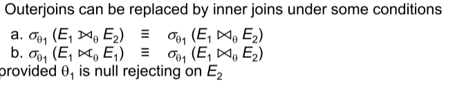
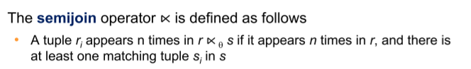
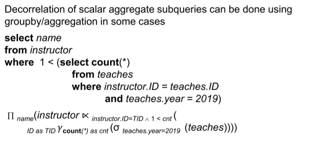

# Query Optimization

**Evaluation Plan** defines the algorithm that is used for each operation, and how they would be co-ordinated. It is usually represented as a tree. Ideally, we would like to chose the cheapest plan based on its estimated cost.

> PostgreSQL shows cost as $f..l$ where $f$ is the cost of delivering the first tuple and $l$ is the cost for delivering all the tuples


## Generating Equivalent Rules

Two rules are equivalent if they generate the same set of tuples for every **legal** dataset instance.

1. **Conjunction**: $\sigma_{\theta_1\wedge\theta_2}(E) \equiv \sigma_{\theta_1}(\sigma_{\theta_2}(E))$

2. **Commutative Selection**: $\sigma_{\theta_1}(\sigma_{\theta_2}(E)) \equiv \sigma_{\theta_2}(\sigma_{\theta_1}(E))$

3. **Commutative Joins**: $E_1\bowtie E_2 \equiv E_2\bowtie E_1$

4. **Subset Projection**: $\Pi_{L_1}(\Pi_{L_2}(E)) \equiv \Pi_{L_1}(E)$ if $L_1\subseteq L_2$

5. **Selections with Products/Joins**: 

   1. $\sigma_{\theta_1}(E_1\times E_2) \equiv E_1 \bowtie_{\theta_1}E_2$
   2. $\sigma_{\theta_1}(E_1\bowtie_{\theta_2} E_2) \equiv E_1\bowtie_{\theta_1\wedge\theta_2} E_2)$

6. **Join Associativity**:

   1. $(E_1\bowtie E_2)\bowtie E_3 \equiv E_1\bowtie (E_2\bowtie E_3)$ - Natural Joins are associative
   2. $(E_1\bowtie_{\theta_1} E_2)\bowtie_{\theta_2\wedge\theta_3} E_3 \equiv E_1\bowtie_{\theta_1\wedge\theta_3} (E_2\bowtie_{\theta_2} E_3)$ - $\theta_2$ contains attributes only from $E_2, E_3$

7. **Select Distribution over Join**:

   $\sigma_{\theta_1\wedge\theta_2}(E_1\bowtie_\theta E_2) \equiv \sigma_{\theta_1}(E_1)\bowtie_\theta\sigma_{\theta_2}(E_2)$ - $\theta_1$ has attributes of only $E_1$ and $\theta_2$ only of $E_2$

8. **Project Distribution over Join**:

   Consider $\Pi_{L_1\cup L_2}(E_1\bowtie_\theta E_2)$, where $L_1$ are attributes of $E_1$ and $L_2$ of $E_2$. Let $L_3$ be the set of attributes that are used in the condition $\theta$ but do not belong to $L_1$, and similarly define $L_4$ for $E_2$.

   $\Pi_{L_1\cup L_2}(E_1\bowtie_\theta E_2) \equiv \Pi_{L_1\cup L_3}\left( \Pi_{L_1\cup L_3}(E_1)\bowtie_\theta\Pi_{L_2\cup L_4}(E_2) \right)$

9. **Union and Intersection are Commutative**

10. **Union and Intersection are Associative**

11. **Select Operation distributes over Union, Intersection and Difference**

    ==slides have additional relations that I didn’t get here!==

12. **Projection is Distributive over Union**: $\Pi_L(E_1\cup E_2) \equiv \Pi_L(E_1)\cup\Pi_L(E_2)$

13. **Selection Distributes over Aggregate**: $\sigma_\theta(_G\gamma_A(E)) = {}_G\gamma_A(\sigma_\theta(E))$ ==provided $\theta$ only involves attributes in $G$==

14. **Outer Join Commutativity**: (They are NOT associative in nature!)

    1. $E_1  ⟗ E_2 = E_2  ⟗ E_1 $
    2. $E_1 ⟕ E_2 = E_2 ⟖ E_1$ ==Note different outer join!==

15. **Selection Distributes over Outer joins**:

    

16. **Replacing outer joins with inner joins**:

    


## Cost Based Optimization of Evaluation Plans

### Join Ordering

$$
(a\bowtie b)\bowtie c \equiv a\bowtie(b\bowtie c)
$$

Here, if $(a\bowtie b)$ is larger than $(b\bowtie c)$ we choose to compute using the right equation so we store a smaller relation temporarily. Now consider the more general case:
$$
r_1\bowtie r_2 \ldots \bowtie r_n
$$
We use dynamic programming to efficiently compute the cost. Let $S = \{r_1, \ldots r_n\}$. We consider all possible plans of form $S'\bowtie(S-S')$ where $S'$ is a non-empty subset of $S$. Recurse on $S'$, storing the costs of every subset and not recomputing them everytime. The complexity of this method would be exponential $\mathcal{O}(3^n)$.

However, if we consider only **LEFT-DEEP** subtrees, the complexity becomes $\mathcal{O}(n2^n)$.

==merge join may be beneficial as sorted attributes make further joins easier!==

## Heuristic Optimization

Cost based optimization can be expensive both memory-wise and time-wise. Most optimizers use heuristics that *usually* tend to reduce execution time.

- Perform selections and projections early
- Perform restrictive selections and joins first
- Use left deep join trees

&nbsp;

# Statistical Cost Estimation

| Symbol         | Meaning                                                      |
| -------------- | ------------------------------------------------------------ |
| $n_r$          | Number of tuples in Relation $r$                             |
| $b_r$          | Number of blocks containing tuples of $r$                    |
| $l_r$ or $s_r$ | Size of a tuple $r$                                          |
| $f_r$          | Blocking Factor, number of tuples that fit into one block. $b_r = \lceil n_r/f_r\rceil$ |
| $V(A,r)$       | Number of distinct values of attribute $A$ of relation $r$   |


## Size Estimation

- $\sigma_{A=v}(r)$

  Assume each distinct value has approximately equal number of rows. The number of records returned would be $n_r/V(A,r)$

- $\sigma_{A\leq v}(r)$

  Assume $\min(A,r)$ and $\max(A,r)$ are known. Assume that the tuples are distributed linearly. The estimated number of tuples would be:
  $$
  \frac{v-\min(A,r)}{\max(A,r)-\min(A,r)}\times n_r
  $$
  We estimate $n_r/2$ if the information is absent. 


## Selectivity

The **selectivity** of a condition $\theta$ is the probability that a tuple in $r$ satisfies $\theta$. If the satisfying tuples are $s_\theta$, selectivity would be $s_\theta/n_r$.

- $\sigma_{\theta_1\wedge\theta_2\ldots\theta_n}(r)$
  $$
  \text{Selectivity} = \frac{s_1\times \ldots s_n}{n_r^n}
  $$

- $\sigma_{\theta_1\lor\theta_2\ldots\theta_n}(r)$
  $$
  \text{Selectivity} = 1-\left[ \left(1-\frac{s_1}{n_r}\right)\ldots\left(1-\frac{s_n}{n_r}\right) \right]
  $$

- $\sigma_{\neg\theta}(r)$: $1-\frac{s_\theta}{n_r}$


### Join Size Estimation

==Multiple Cases about something....==

### Other Operations

- Estimated size of $\Pi_{A}(r)$: $V(A,r)$
- Estimated size of ${}_G\gamma_A(r)$: $V(G,r)$

- Estimated size of $r⟕s$: size of $r\bowtie s$ + size of $r$
- Estimated size of $r⟗s$: size of $r\bowtie s$ + size of $r$ + size of $s$ 


## Distinct Value Estimation

- $\sigma_\theta(r)$
  1. $\theta$ forces $A$ to take a specific value - $V(A,\sigma_\theta(r))=1$
  2. $\theta$ forces $A$ to take multiple specified values - $V(A,\sigma_\theta(r))=$num values specified
  3. **$\theta$ is of form $A\text{ op }r$ - $V(A,\sigma_\theta(r)) = V(A,r)\times \text{selectivity}_\theta$**
  4. In all other cases - $V(A,\sigma_\theta(r)) = \min(V(A,r), n_{\sigma_\theta(r)})$

- $r\bowtie s$

  Let $A$ contain $A_1$ from $r$ and $A_2$ from $s$. The estimate would be given by:
  $$
  V(A,r\bowtie s) = \min(V(A_1,r)\cdot V(A_2-A_1,s), n_{r\bowtie s}, V(A_1-A_2,r)\cdot V(A_2,s))
  $$

&nbsp;

# Optimizing Nested Subqueries

The variables of the outer queries that are used by the nested queries are called as **correlation variables**. Usually, the nested subquery is executed once for every tuple in the `from` clause’s relation. This is called **correlated evaluation**, and is very inefficient!

Usually, we try to use joins instead of subqueries, but this can cause different number of duplicates. We introduce the **semi-join** operator to solve this problem.



In general, SQL queries of the following form are written using semi joins.

```sql
select A
from r1, r2, ... rn
where P1 and exists (select *
                     from s1, s2, ... sm
                     where P21 and P22)
```

Here, $P21$ contains the predicates that do **not** involve correlation variables, and $P22$ has predicates that contain correlation variables. This can be written as:
$$
\Pi_A\left[ \sigma_{P1}(r1\times r2\ldots rn) \ltimes_{P22}\sigma_{P21}(s1\times s2\ldots sm) \right]
$$
This process of replacing the nested query is called as **decorrelation**.

This example is quite important, try working in a bottom-up manner to get the final relational algebra query. 



# Materialized Views

A view whose contents are computed and stored are called as materialized views. Keeping it upto date with the underlying data is called as maintenance. **Incremental** maintenance computes the updates everytime the database is updated.

The changes to a relation or expression are called as its **differential**.

### Join Operation

Consider the relation $v = r\bowtie s$, with $r_{new}$ being the updated data and $r_{old}$ being the outdated data. Outer joins are handled similarly with additional cases.

- **Inserts** - $v_{new} = v_{old} \cup(i_r\bowtie s)$
- **Deletes** -$v_{new} = v_{old} -(d_r\bowtie s)$  

### Selection Operation

Very similar to the ones used in join operation. Let the view be $v = \sigma_\theta(r)$.

- **Inserts** - $v_{new} = v_{old} \cup\sigma_\theta(i_r)$
- **Deletes** -$v_{new} = v_{old} -\sigma_\theta(d_r)$ 

### Projection Operation

Let the view be $v = \Pi_A(r)$. Keep a count of each tuple in the view, and update the corresponding count when a row is deleted in $r$. Delete the tuple from the view when the count hits 0.

### Aggregation Operation

- **Count**: $v = {}_A\gamma_{count(B)}(r)$

  Update the count/add a new tuple when a new row is added into $r$. Delete the tuple when count is 0.

- **Sum**: $v = {}_A\gamma_{Sum(B)}(r)$

  Maintain both count and sum for each tuple, and update accordingly. Delete when the count of a tuple is 0. Similarly for average, divide them when value is requested.

**Expressions** are handled by computing the incremental change for the sub-expressions and propagating the changes in a bottom-up manner.