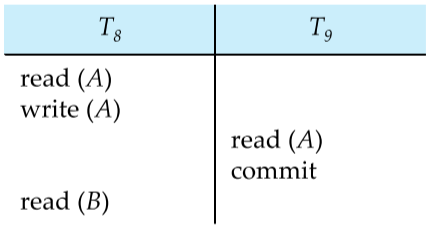

# Transactions

A transaction is a **unit** of program execution that accesses and possibly updates various data items. Transactions have four main characteristics, abbreviated as the **ACID** properties.

1. **A**tomicity - System should ensure that a partially executed transaction must not be reflected in the final database, irrespective of software or hardware failures.
2. **C**onsistency - Both explicit and implicit constraints of a database must be satisfied at the end of any transaction; it is possible that they might be violated during the transaction.
3. **I**solation - Other transactions should be unable to see the partially updated (and possibly inconsistent) database
4. **D**urability - The changes made by a transaction must be reflected after successful completion, even if system failures occur.

There are **five** main states for a transaction:

- **Active** - transaction is being executed, is the initial state
- **Partially Committed** - Final statement of the transaction has been executed
- **Failed** - Normal execution can no longer occur
- **Aborted** - The transaction has been rolled back and the database has been restored. We can either restart the transaction (if error wasn’t logical) or kill it entirely
- **Committed** - Successful execution of transaction

There is no back arrow from aborted to active because restarting the transaction is the system’s job


# Concurrency

**Concurrency Control Schemes** are the mechanisms used to achieve isolation. A **schedule** specifies the chronological order in which instructions of the concurrent transactions are executed. We assume each transaction to preserve database consistency. Moreover, we consider only `read` and `write` instructions for now.


## Serializability

A schedule is said to be serializable if it is equivalent to a serial schedule of transactions. There are two main kinds of serialization:

- **Conflict** serializability
- **View** serializability


### Conflict Serializability

Two instructions $I_i$ and $I_j$ belonging to transactions $T_i$ and $T_j$ are said to be conflicting if they both access the same item $Q$ and at least one of them writes to $Q$. 

Schedules $S$ and $S’$ are said to be **Conflict Equivalent** if they can be interconverted by swapping non-conflicting instructions. $S$ is said to be **Conflict Serializable** if it is equivalent to a serial schedule.

### View Serializability

Two transactions $S$ and $S’$ are said to be **view equivalent** if the following conditions hold for all data items $Q$. A schedule is View Serializable if it is equivalent to a serial schedule.

1. If transaction $T_i$ reads the initial value of $Q$ in schedule $S$, then $T_i$ must read the initial value of $Q$ in $S’$ as well
2. If transaction $T_i$ reads the value of $Q$ that was written by a `write` executed by $T_j$ in schedule $S$, then $T_i$ must read $Q$ that was written by the same `write` operation by $T_j$ in $S’$ as well
3. The transaction performing the final write operation of $Q$ in $S$ must do so in $S’$ as well

==$\text{Conflict Serializable}\implies\text{View Serializable}$==

**Blind writes** (writing to $Q$ without reading it first) cause a view serializable schedule to not be conflict serializable.

==Two non-equivalent schedules may have the same outcome!==


### Testing for Conflict Serializability - Precedence Graphs

Given the transactions $T_1, T_2,\ldots T_n$ we can construct a directed graph with the transactions as vertices. An edge $T_i\to T_j$ is added if there is conflict between them, and $T_i$ accesses the conflicting data item **first**. The edge may be labeled by the conflicting item.

==A schedule is **Conflict Serializable** iff its precedence graph is acyclic.==  The serializability order can be obtained by topological sorting of the graph.

Testing for view serializability using precedence graphs is an NP-Hard problem, and thus the existence of an efficient algorithm is *extremely* unlikely.

&nbsp;

## Recoverable Schedules

A transaction $T_j$ reads a data item previously written by $T_i$, then $T_i$ should commit before $T_j$ for the schedule to be **recoverable**. The schedule given below is not recoverable, as $T_8$ could rollback after $T_9$ commits with an incorrect value that $T_8$ wrote to $A$.



Moreover, we would like **cascading rollbacks** to be absent so that much of the work done is not undone by a single transaction aborting. Schedules where cascading rollbacks do not occur are called as **Cascade-less Schedules**.

**Cascade-less Schedules** - Every $T_j$ that reads a data item written by $T_i$ must have its `read(Q)` operation **after** $T_i$ has committed

> $$
> \text{Cascadeless Schedule}\implies\text{Recoverable Schedule}
> $$

&nbsp;

# Concurrency Control

Ideally, we would like the schedule decided to be conflict/view serializable, recoverable, and preferably cascade-less. There are different “levels” of consistency that databases might demand:

1. **Serializable**
2. **Repeatable Read** - Only committed records to be read, with repeated reads of the same record **always** returning the same value. The transaction may not be serializable
3. **Read Committed** - only committed records can be read, but repeated reads may give different values
4. **Read Uncommitted** - Even uncommitted records can be read

==Repeatable read and read committed??==

Lower levels of consistency are usually just used to gather approximate information about the database.

### Phantom Phenomenon

Consider the following SQL transactions that we wish to execute concurrently.

```sql
# Transaction 1
select ID,name from instructor where salary > 90000

# Transaction 2
insert into instructor values ('11111', 'James', 'Marketing', 100000)
```

It is possible that T1 starts first, and locks the records which satisfy the `where` clause. However, if we were to then execute T2, **tuple level locking is unable to detect this conflict!**

We thus need to detect **“predicate”** conflicts, and use some form of predicate locking!