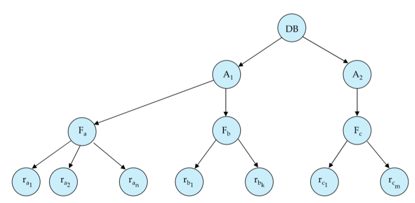

# Concurrency Control

Locks are used to control concurrent access to a data item. Data items can be locked in two modes;

1. **Exclusive** (X) - The writer locks, requested using `lock-X` function
2. **Shared** (S) - The reader locks, requested using `lock-S` function

The requests for these locks are made to the **concurrency-control** manager. A lock is granted IFF the requested lock is compatible with all the other locks already held on the data item.

Deadlocks need to be detected and the corresponding transaction needs to be rolled back, releasing all of its locks. Moreover, improper protocols can cause **starvation**. For example, consider a transaction waiting for an X-Lock and multiple S-Locks being issued. We look at a few locking protocols to understand how these problems are dealt with.

## Two Phase Locking Protocol

> This protocol ensures **Conflict-Serializable** schedules

As the name suggests, there are two phases in this protocol:

1. **Growing Phase** - Any transaction can only obtain locks, releasing locks is prohibited
2. **Shrinking Phase** - Any transaction can only release locks, obtaining locks is prohibited

It can be proved that transactions can be serialized in order of their **lock points.** (the point where a transaction obtains its final lock)

Note that two phase locking **does not ensure freedom from deadlocks**. Extensions to the protocols need to be made to prevent cascading roll-backs:

- **Strict** two phase locking - A transaction must hold all X-Locks until commit. This ensures **recoverability** on top of avoiding cascading rollbacks
- **Rigorous** two phase locking - A transaction must hold ALL locks until commit. Therefore, they can be serialized in order of commit.

Two phase locking is not a necessary condition; there are conflict serializable schedules that cannot be obtained using the two phase locking protocol.

A schedule $S$ is said to be **legal** if it can be generated by a set of transactions that follow the protocol; and a protocol **ensures serializability** if all legal schedules under that protocol are serializable.

Two phase LP allows lock conversions in the growing phase ($S\to X$) and the shrinking phase ($X\to S$), and this assures serializability!

Usually, locks are acquired automatically as required. That is, `read(Q)` tries to acquire an S-lock on $Q$ if it doesn’t already have one; and similarly `write(Q)` tries to acquire an X-lock.

# Implementing Locking

The lock manager maintains a **lock table** that records the locks granted so far and the pending requests for them too. The lock table records the type of lock granted or requested, with new requests being added to the end of a queue. If a particular transaction aborts, all waiting/granted requests are deleted.

## Graph Based Protocols: Tree Protocol

We impose a partial ordering on the set of all data items $D = \{d_1,d_2\ldots d_h\}$. If $d_i\to d_j$ then any transaction accessing both $d_i$ and $d_j$ must access $d_i$ before accessing $d_j$.

The tree protocol builds on this idea, by making the partial ordering be a tree.

1. Only exclusive locks are allowed
2. The first lock by a transaction $T$ may be on any item. Subsequently, a data item $Q$ can only be locked by $T$ if its parent has also been locked by $T$
3. Data items may be unlocked at any time
   1. A data item that has been locked and unlocked by $T$, cannot subsequently be relocked by $T$ again (two phase locking)

This protocol ensures **conflict serializability** and **freedom from deadlocks**. We cannot ensure recoverability, and cascading rollbacks are also possible. Schedules not possible under 2PL are possible under the tree protocol and vice versa.

# Deadlock Handling

## Deadlock Prevention

A system is said to be **deadlocked** if all transactions in the set are waiting for some other transaction in the set. One way to prevent deadlocking would be to **pre-acquire** all the locks that a transaction required before it begins execution. Another method would be to impose partial ordering as discussed earlier. There are other schemes too:

- **Wait-Die Scheme** - Non Preemptive

  The older transaction waits for the younger one to release the data item. Younger transactions never wait for older ones, they are rolled back instead. Therefore, a transaction may be rolled back several times before a lock is acquired.

- **Wound-Wait Scheme** - Preemptive

  Older transaction forces the younger to rollback instead of waiting for it. Younger transactions may wait for old ones. There are fewer roll backs than wait-die scheme.

- **Timeout based Schemes**

  A transaction is rolled back automatically if a specified amount of time is exceeded.

## Deadlock Detection: Wait-for graph

Create a graph with transactions as vertices, and a directed edge $T_i \to T_j$ exists if $T_i$ is waiting for a lock that is held in conflicting mode by $T_j$. 

> The system is in deadlock IFF the wait for graph has a cycle!

## Deadlock Recovery

A **victim** transaction is chosen to be rolled back. The rollback may either be **total** (completely abort the transaction) or **partial** (roll the victim back as far as necessary so that required locks are released).

Improper implementation of choosing the victim can lead to starvation.

# Multiple Granularity Locking Scheme

The data items can be abstracted to be of various sizes and we can define a hierarchy of data granularity. This hierarchy can be represented as a tree. (Not to be confused with the tree protocol) An example is given below, with $\text{Database}\to\text{Area}\to\text{File}\to\text{Record}$ hierarchy.

Explicitly locking a node in the tree implicitly also locks all of its descendants. **Fine Granularity** would be locking the records themselves and **Coarse Granularity** would be database level locking (extremes).

Three lock modes additional to S/X are introduced:

1. **Intention Shared (IS)** - Explicit locking at lower level of tree but with only shared locks
2. **Intention Exclusive (IX)** - Explicit locking at lower levels with both shared and exclusive locks
3. **Shared and Intention Exclusive (SIX)** - The subtree rooted that node is locked explicitly by a shared lock and explicit exclusive locks are being done at lower levels

|         | IS   | IX   | S    | SIX  | X    |
| ------- | ---- | ---- | ---- | ---- | ---- |
| **IS**  | ✓    | ✓    | ✓    | ✓    |      |
| **IX**  | ✓    | ✓    |      |      |      |
| **S**   | ✓    |      | ✓    |      |      |
| **SIX** | ✓    |      |      |      |      |
| **X**   |      |      |      |      |      |

The rules to be followed by a transaction $T_i$ to lock a node $Q$ are:

1. Lock the root node of the tree in any mode
2. A node can be locked in $S$ or $IS$ modes only if the parent is locked in $IS$ or $IX$ by $T_i$
3. A node can be locked in $X$, $IX$ or $SIX$ modes only if the parent is locked in $IX$ or $SIX$ modes by $T_i$
4. $T_i$ can lock a node only if it hasn’t released a lock (two phase)
5. $T_i$ can release a lock only if none of the children are locked by $T_i$

We lock top-bottom, and unlock bottom-up.

**Lock Granularity Escalation**: Increase the granularity if there are too many locks at a particular level.

## Phantom Phenomenon: Index Locking Protocol

As briefly touched upon in the previous chapter, predicate level locking might need to be used here. One idea would be to treat the entire relation like a data item, and provide shared locks for reading the relation and provide exclusive locks when a transaction wishes to modify the relation. This is very inefficient, however.

**Index Locking Protocol** is used to prevent phantoms. Every record would have a index that would be used to look up and find records. 

- A transaction $T_i$ that performs look up would lock **ALL Leaf Nodes that it accesses** in S-mode (even the leaves that do not contain a tuple satisfying the lookup query)
- Similarly, an X-lock would be required for all index leaf nodes affected by an insert/update/delete by $T_i$
- Two phase locking protocol must be observed

### Next Key Locking Protocol

Index locking can cause poor performance for inserts as the entire leaf is locked. Next key locking protocol has much higher concurrency.

- Lock all values that satisfy index lookup
- Also lock the next key value in index (S for reads, X for insert/update/delete)

==Very murky, a demonstration would be appreciated...==

# Timestamp based Concurrency Control

Each transaction $T_i$ is given a **unique** timestamp when it enters the system. Timestamp based protocols maintain order such that **time-stamp order == serializability order**.

## Timestamp Ordering Protocol (TSO)

For each data $Q$ we maintain two timestamp values

- **W-timestamp**(Q) is the largest timestamp that executed `write(Q)` successfully
- **R-timestamp**(Q) is the largest timestamp that executed `read(Q)` successfuly

Suppose a transaction $T_i$ tries to execute `read(Q)`

- If $TS(T_i) \leq \text{W-Timestamp}(Q)$, then $T_i$ is trying to read an overwritten value of $Q$. We thus rollback the transaction.
- Else, the read operation is executed and the R-timestamp(Q) is set to $\max(\text{R-Timestamp}(Q),TS(T_i))$ 

Similarly assume it tried to execute `write(Q)`

- If $TS(T_i) < \text{R-Timestamp}(Q)$ then the system did not expect this write to be present. The operation is thus rolled back
- If $TS(T_i) <\text{W-Timestamp}(Q)$ then we are trying to write to an obsolete value of $Q$. The operation is thus rolled back
- Else the write operation proceeds and W-Timestamp of Q is set to $TS(T_i)$

TSO algorithm ensures **serializability** and **freedom from deadlocks**. However, the schedule may not be recoverable and it might still not be cascade-free. There are three main ways of solving this problem:

1. Structure the transaction such that all writes are performed at the end. All the writes would form an atomic action with other transactions not being allowed to execute until these are done. ==Update the time stamp of a transaction when it aborts!==
2. Wait for data to be committed before reading it (**limited locking idea**)
3. Use commit dependencies to ensure recoverability

## Thomas’ Write Rule

Exactly the same as TSO, except that obsolete writes do not cause roll backs. That is, if $TS(T_i)<\text{W-Timestamp(Q)}$ then the `write` operation is ignored instead of rolling $T_i$ back. (“It would have been overwritten anyway, so why bother”)

**This allows some view-serializable schedules that are not conflict serializable.**

## Validation Based Protocol (Optimistic Concurrency Control)

Instead of the timestamp of a transaction, we use the commit time as the serialization order. This is called optimistic because the transaction is fully carried out assuming that all will be well during validation.

1. We postpone writes to end of transaction
2. Keep track of data items read/written by the transaction
3. **Validate** changes at commit time and detect any out-of-serialization order reads/writes

The execution of transaction $T_i$ is done in the following three phases. Note that for simplicity, we assume the last two phases to occur atomically and serially after each other for any transaction.

1. **Read and Execution Phase**: $T_i$ writes only to temporary local variables
2. **Validation Phase**: A validation test is performed to check if serializability is being violated
3. **Write Phase**: Updates are applied to database if check passes

Three time-stamps are maintained for every transaction;

- `StartTS(T_i)` : time when $T_i$ starts execution
- `ValidationTS(T_i)` : time when validation starts
- `FinishTS(T_i)` : time when write is finished

### Validation Checks

For any given pair of transaction $T_i$ and $T_j$ such that $TS(T_i) < TS(T_j)$, the following two rules must hold:

- `FinishTS(T_i) < StartTS(T_j)` - trivial condition when no concurrency
- `StartTS(T_j) < FinishTS(T_i) < ValidationTS(T_j)` - validation must happen after $T_i$ is done

Validation fails and $T_j$ is aborted when the following condition doesn’t hold!

&nbsp;

# Multi-version Concurrency Control

Multiple versions of data items are stored to improve concurrency. Each successful `write` results in the creation of a new version; and `read` looks at all the versions and returns the an appropriate value based on its timestamp. 

Each data item $Q$ is a sequence of versions $<Q_1,Q_2\ldots Q_m>$ where each version has **three** data fields:

- **Content**: The value stored
- **W-Timestamp** - the timestamp of the transaction that made $Q_k$
- **R-Timestamp** - the largest timestamp of a transaction that read $Q_k$

Now suppose that a transaction $T_i$ issues `read(Q)`, and $Q_k$ is the version with the largest timestamp that is less than or equal to $TS(T_i)$.

1. The value returned is the value of $Q_k$
2. If $TS(T_i) > \text{R-Timestamp}(Q_k)$ then update the R-Timestamp 

Now assume that $T_i$ issues a `write(Q)` operation.

1. If $TS(T_i) < \text{R-Timestamp}(Q_k)$ then $T_i$ is obsolete, so we roll it back
2. If $TS(T_i) = \text{W-Timestamp}(Q_k)$, overwrite $Q_k$‘s value
3. Else, make a new version of the data item with both W-Timestamp and R-Timestamp initialized to $T_i$

This protocol guarantees **serializability** as writes enforce a definite timestamp ordering.

### Multiversion Two Phase Locking

**Rigorous** two phase locking is followed by update transactions. The database maintains a `ts-counter` to assign timestamps to each transaction.

==Didn’t get this part!==
