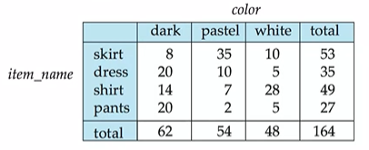
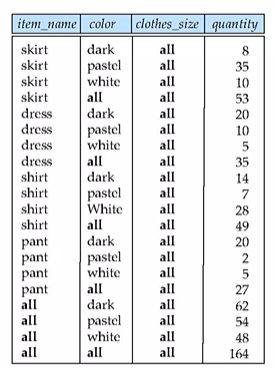

# Advanced SQL


*do shit*


## Functions and Procedures

SQL standard allows for declaring functions which can return scalars (scalar function), tables (table function) and it also has `for` loop constructs available.

```sql
create function <name>(<arguments>)
	returns <return_type>;
	declare n integer default 0;
	begin
	<function stuff here>
end;
```


SQL also allows us to define functions in an external language such as C,C++,Java and call them using their binaries. However, C and C++ are not "safe" because they let the user to get pointers to anywhere in the memory which is not secure. Java and C# are usually considered safe. **Sandbox** techniques such as using safe languages or allowed modules in C++/C ensure security. This obviously has an overhead cost though.


## Triggers

A statement executed by the system as a side effect of a modification to the database. There are two main parts to a trigger:

1. **When** should a trigger be executed?
2. **What** should a trigger do?

Note that the syntax for triggers is heavily dependent on the used database language.

Row-level triggers execute upon changes to a row. Statement-level triggers are used when we want a trigger after a set of insertions/deletions.

Triggers may execute unintentionally when loading data from a back up copy or replicating updates at a remote sites. 


## Recursive Queries

> "Find courses which are pre-requisites directly or indirectly for a specific course."

Such queries require recursion.

```sql
with recursive rec_prereq(course_id, prereq_id) as(
    -- Direct pre requisites
	select course_id,prereq_id
    from prereq
  union
    -- Indirect pre requisites
    select rec_prereq.course_id,prereq.prereq_id
    from rec_prereq,prereq
    where rec_prereq.prereq_id = prereq.course_id
)
select * from rec_prereq;

-- First we get the direct pre requisites
-- In the first iteration of indirect, we get the second-indirect pre requisites
-- We get the next level of pre requisites in the next iteration
```

Recursive query terminates when no new additions are made to the relation after an iteration. This termination condition is called **Fixed-point recursion**, and the query is an example of **transitive relation** query.

==We require the recursive views to be monotonic so that a fixed point exists.==

Aggregation in general does **not** reserve monotonicity. (adding new values gives a different result, not a superset of the previous result) Similar for `not in`, `except` and so on...


## Advanced Aggregation

### Ranking

```sql
select rank() over (order by <attribute> asc/decs nulls last) as s_rank
```

`rank()` is sparse by default. That is, gaps are left in the ranking if two elements have the same rank. `dense_rank()` does not leave any gaps in the ranking.

Ranking can be done for a partition over the relation as well!

```sql
select rank() over (partition by <attribute> order by <attribute> asc/desc)
```

Strictly speaking, `rank()` is not needed as we can just count the number of elements greater than the current row. This indirect method is very inefficient, however.

`limit n` prints only the top `n` tuples within each partition. This is not recommended as it is not deterministic in nature.

*missed stuff*


### Windowing

*missed windowing*


&nbsp;


# OLAP - Online Analytical Processing

This feature of SQL aims to allow dat to be summarized and viewed in different ways with negligible delay. The data which can be modeled as dimension attributes and measure attributes is called as **multidimensional data**.

- *Measure Attributes* - measures some attribute which can be aggregated, eg number of shirts
- *Dimension Attributes* - define the dimensions on which measure attributes are viewed, eg size of shirts



This table is an example of a **cross-tabulation** (cross-tab) or a **pivot table**. Note that the schema of this table is not hardcoded. The columns and rows are made dynamically based on the data available.

**Data Cube** is a multi dimensional generalization of a cross tab. It may be $>3$ dimensional in nature. Representing such “cubes” is done using hierarchies in cross tabs. The value **all** is used to represent aggregates. 



==SQL standard uses **null** instead of all in cross tabs despite the confusions caused. `grouping()` is applied on an attribute, and returns 1if the null value represents all and 0 in other cases.==

Cube operation in SQL performs union over group by for every possible subset of specified attributes. That is, union is applied on $2^n$ group by operations when $n$ attributes are specified.

```sql
select item_name, color, size, sum(number)
from sales(item_name, color, size, number)
group by cube(item_name, color, size);
```

Rollup performs union over $n$ prefixes for a given set of attributes. That it, if the given attributes are $(a,b,c)$, a union over group by is performed for $\{(a,b,c), (a,b), (a), ()\}$. It used for hierarchy. Drilldown is the opposite operation.

