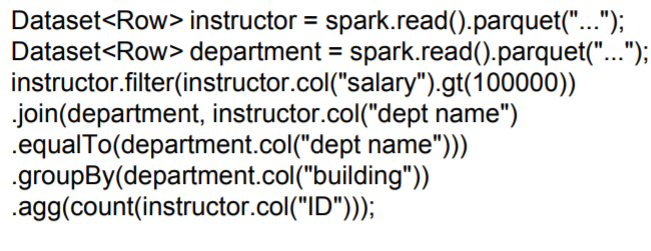

# Big Data

Express the stuff that we want to do in parallel using **MapReduce** paradigms. This was introduced by google. This ensures abstraction for the programmer ensuring that the system takes care of parallelization and atomicity of instructions (dataloss prevented for crashes and stuff). Hadoop is an open-source Java based implementation of the map reduce paradigm.


#### Problem 1 - Word count

Consider the problem of getting the word count of each word in a large collection of documents. We want to parallelize this:

1. Give each computer a part of the document
2. Break up the document into words and give each computer one word to look at

The process of breaking the problem up is handled by the `Map()` function and their aggregation is handled by the `reduce()` function. For example, consider the input `word = “a b c a d b”`

- `Map(word)` : `{('a',1), ('b',1), ('c',1), ('a',1), ('d',1), ('b',1)}`, store this result in the variable `record`

- `reduce('a', record)`: `('a',2)`

  `reduce('b', record)`: `('b',2)`

That is, `reduce()` is called for every unique word in the set of documents.


#### Problem 2 - Log Processing

Given log files, we want to find the number of times each of the files in the given directory was accessed between a given period of time. Moreover, we would like to do this using the MapReduce abstraction. Using a similar Map-Reduce definition pair is not possible because sending the same word $n$ times is very expensive and inefficient, which is why the reduce function is used locally first before sending the data for further aggregation.


Note that many uses of MapReduce cannot be implemented using SQL, but the ones that can be implemented are infinitely easier. 


*yeah the slides*


# Spark Running Notes

Spark uses Java8 lambda expressions as follows:

```java
// s -> <some function involving s>
s -> new Tuple2<>(s,1);
// s is taken as the argument for running the defined function
```


RDD is “lazy”, meaning that all algebraic calculations are computed when needed. This lets the created operator tree be optimized prior to execution.

blah blah `collect()` at end for obvious reasons...

RDDs have parsing as bottleneck, so introduce `DataSet`allows types to be defined *dynamically*. `Row` is an example of a type. `DataSet` also has operations such as filter, join, groupBy...

==PSQL can be written and SPARK can translate those to its format. Moreover all these functions are lazy as well!==



`parquet()` - nothing much, just input file format specifications

*missed smth regarding caches..*


&nbsp;

## Streaming Data

“Streaming” refers to data that arrives in a continuous fashion.

Handling methods are intuitive, either use a moving window or continuous queries which outputs partial results based on the results seen so far.

**Lambda Architecture** - the stream is split in 2, with one going to the db for storage and other for processing (kinda like how outputs in RNN work ig?) However, this splitting causes a double querying effort, and is thus not used much now-a-days.


> why is System.Timestamp a bad idea? “Ideally you would compute the timestamp upon user input ”


wow thanks for the existential crisis my dude, Neo4J was made by people in IITB

ffs


*oh for fuck’s sake I have no idea wwhat happened here*

&nbsp;

## Bulk Synchronous Processing

One of the 2 methods of handling huge graph networks. It has low overheads compared to the `map-reduce` paradigms.


