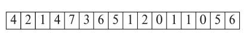
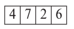

# Data Storage Structures

Database -> files -> records -> fields

Our assumptions:

- Record size is fixed
- Each file has records of one type
- different files used for different relations
- Records smaller then a disk block

### Fixed Length Records

Similar to how an array is handled. The $i$th entry is stored starting from byte $n\times(i-1)$ where $n$ is the size of each record. This may cause crossing of blocks; so take care of that case.

When deleting records, don’t move the following records behind; but rather link all the free records on a *free list*.

### Variable Length Records

Store attributes in order, with the actual data of the var length fields stored after fixed length fields. Firstly var length attr stored as <offset, length of attribute>. Note that this pair is stored with fixed length, 4 Bytes in this case.

### Slotted Page Structure

Records can be moved to make the free space contiguous. It is not possible to store a pointer to a record directly, instead to point to the **record entry** in the header.

#### 

**Large Files Handling** - Fragment the blob/clob into smaller files which are stored using the filesystem, and store the location to these files in db

&nbsp;

## File Organization

**Heap** - Place a records anywhere you find space

**Sequential** - Sort the records based on a `search` key, so that finding data is easier. Not good for large databases $\mathcal{O}(n\log n)$

**B+ Tree** has ordered storage with both inserts and deletes, and **Hashing** on the search key might specify the block where the record needs to be placed.

### Heap 

> Where the fuck do I store my data?

Searching the entire heap for free space is very bad, so we use a free space map. A few bits at the start of each block may indicate what fraction of the block is free.

Second Level Bit Map could store the maximum of every four entries from the first level free map.

**First Level Example**

**Corresponding second level example**

This free space map is written to the disk periodically. However, notice that updated need not necessarily change the map values; meaning that **it is okay** to store old values. We would have to keep updating the data periodically to ensure that they aren’t largely out of sync.

### Sequential

Note that they need not be sequential physically, but a linked list of pointers is ordered sequentially. (So much for $\mathcal{O}(\log n)$ search I guess, whats the point of a linked list)

reorganization of data takes time.

*didnt pay attention for one sec and the prof skipped few slides whaaaa*

&nbsp;

# Metadata

Consists of 

- names, types and length of each attributes
- names of each relation
- names and definitions of views
- integrity constraints
- user information (**including passwords**)
- statistical data, such as number of tuples in a relation
- physical file allocation information (eg. *how* is the data stored, *where* is it stored)
- Indices information

