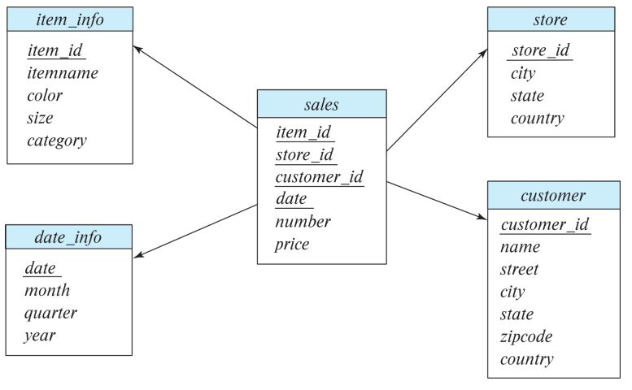

Chapter 11 is not going to be covered in class.. just for notation and terminology and stuff (more importantly this isn’t there for the test)

Data Analytics refers to the processing of data to infer patterns and stuff. Data usually is stored in various different schemas, and thus requires to be integrated into a common schema. *Business Intelligence* is synonymous with data analytics.

- **Extract-Transform-Load**
- **Extract-Load-Transform**

Summarize the aggregated data using dashboards and stuff. *Decision Support* focuses on reporting and aggregation.

**Data warehouse**: A repository of information gathered from multiple sources under a *unified* schema at a single place. It stores not only the current data, but historical stuff as well bc corporate decision making usually needs the past’s data too.

Data is divided into:

1. **Fact Tables** - quite large, `sales(item_id, store_id, cust_id, cost)`
2. **Dimension Tables** - relatively smaller, store additional information about stores, customers' data...

Attributes of fact tables, similar to the attribute types of a cross tab:

1. **Measure** - values that can be aggregated upon
2. **Dimension** - dimensions upon which the measure attributes are viewed `color, size` and stuff (recall cross tab example!)

This is an example of *Star Schema*

If each of the “child” entities were related to other entities, it would be a **snowflake schema**.

*column oriented storage????*