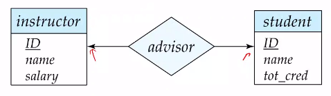
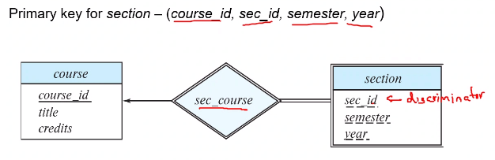
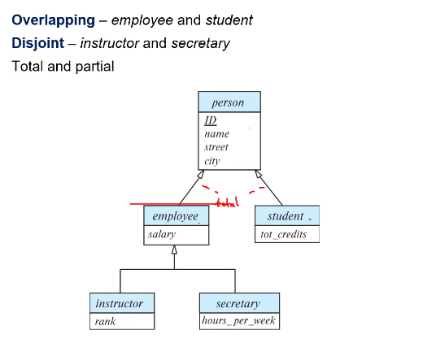
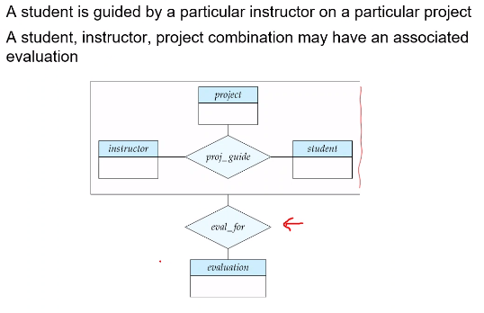
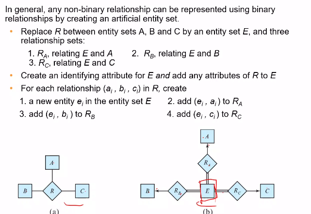

# Database Design using E-R Model

In designing a database schema, we must ensure to avoid two main problems:

- Redundancy - causes inefficient use of storage, and inconsistency of all data is not updated
- Incompleteness - inability of the schema unable to represent certain aspects of the data

We will be looking at the **Entity Relationship model** in this chapter. An *entity* is an object that is distinguishable from each other, and a *relationship* shows the connection between different entities.

*Entity Set* $E$ contains all entities with a common attribute. A subset of the attributes form a **primary key of that entity set** to be able to uniquely distinguish entities in the set.

*Relationship Set* is a mathematical relation among $n\geq 2$ entities, each taken from entity sets. $(e_1, \ldots, e_n)$ is a relationship in the below formulation. They are represented using Diamonds in schema diagrams. **Note that relationship sets may have attributes specifically designed for them**. That is, we may want to keep track of when a student met their advisor for an “advisor” relationship.
$$
\{ (e_1, \cdots, e_n) \vert e_1\in E_1, \ldots, e_n\in E_n\}
$$
The occurrence of an entity set plays a role in the relationship. This is denoted by labeling the line connecting the set and the relationship set. The number of entity sets involved denotes the degree of the relationship set. (not the attributes!) Relationships with degree > 2 is very rare, however.

**Composite Attributes** allow us to divide them into subparts. They are represented by indenting the underlying attributes.

**Mapping Cardinalities** refers to denoting the entities which can be related to each other. They are denoted by using either an arrow(one) or a line(many). For example, the below representation denotes a ONE-ONE relationship. To avoid confusion, we outlaw more than one arrow in relationships between multiple (>2) entity sets.




**Total Participation** is indicated by a double line, and means that every entity in the entity set must participate in the relationship at least once. **Partial Participation** is depicted by a single line and means that no such constraint exists. Moreover, a label of form $x..y$ indicates that every entity is associated with atleast $x$ and atmost $y$ relations. $*$ indicates no limit.


### Primary Keys

We’ve already seen how primary keys work for entity sets. For relationship sets, the combination of primary keys of the involved entity sets is a possible primary key (i.e. , it is a **superkey**)

- **Many-Many**: Union of the primary keys is a minimal superkey and is chosen as the primary key
- **Many-One**: The primary key of the “many” entity set is minimal superkey
- **One-One**: Primary key of either entity sets can act as a minimal superkey

A **weak entity set** does not have enough attributes to form a primary key by itself. It uses a relation to the identifying strong entity set to make primary keys. Weak entity sets are denoted using a double box, and the identifying relationship is shown in a double diamond.

Consider the following entity sets:

```sql
section(course_id, sec_Id, semester, year);
course(course_id, title, credits);
```

`course_id` is redundant and stored twice. We thus remove it from `section` causing it to become a weak entity set.



Entity sets which are not weak are said to be strong. A weak entity set must relate to a strong entity set (it is **existence dependent** on the identifying entity set), and the strong entity set is said to **own** the weak entity set. The relationship is called as an **identifying relationship**.


*redundancy of schemas?*


## Specialization

Indicated by “hollow” arrows.



Here, `student` and `employee` may overlap with each other. That is, a student may be an employee as well. However, `instructor` and `secretary` are not overlapping (disjoint).

`Total` means that every person must be either a student or an employee or both. Partial means that a person need not belong to either of the two relations. These are called as **completeness constraints**.

### Representing  specialization in schema

One way is to form a schema for the higher-level entity, and include the primary key for every lower level entity. Disadvantage here is that data is distributed and not localized.

Another way is to make a schema for every entity set with all the inherited attributes. Redundancy and subsequent inconsistency of data can cause problems later down the road. (Recommended when `total` completeness constraint is used as the parent is not needed to be stored)


## Aggregation

A way of treating a relationship set like an entity set to eliminate redundancy. The following example works because we know every `(student, project, instructor)` tuple would have a single evaluation. 



The primary key for this relation would be the union of primary keys of `instructor`, `project` and `student` entity sets.


*missed 10 minutes of lecture on 27th*


## Converting Non Binary Relations

If the database does not support ternary relationships, we can convert it into a trio of binary relationships  plus a weak entity set as shown below.




&nbsp;

