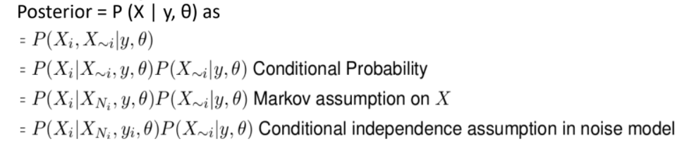
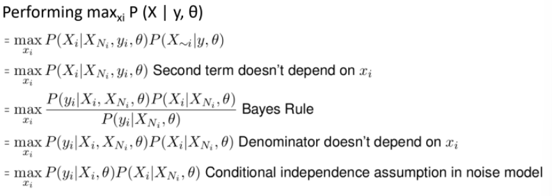
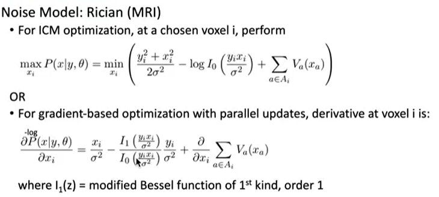
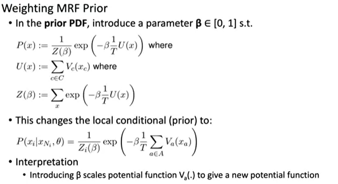
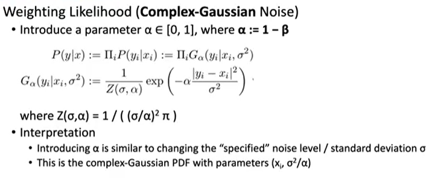

<!-- Notes Begin from here -->

 We shall only concern ourselves with noise models which are independent of the image's distribution, and that the pixel intensities are IID in nature.

Let the random variable $X$ model the observed intensity at a pixel/voxel. The **SNR** (Signal to Noise Ratio) is given by:

$$
\text{SNR} = \frac{E[X]}{SD[X]}
$$

*Gaussian Distribution* is the most common noise model in medical imaging. This is because of the **Central Limit Theorem**. Also, the thermal noise caused by thermal agitation happens to be similar to gaussian distribution. Brownian motion adds gaussian noise when dealing with liquids.

*Poisson Distribution* is used as the noise model when measurement is made by accumulation of photons (photography, x-rays, CT, light microscopes)

$$
P(X=k;\lambda) = \frac{\lambda \exp(-\lambda)}{k!}\qquad E[X]=Var[X]=\lambda
$$

**Compound Poisson** is a sum of Poisson distributions, and can be approximated with gaussian distributions.

$$
Y = \Sigma_iX_i \text{ where } P(X_i)=Poisson(X_i,\lambda_i)
$$

**Rician (Rice)**

MRI data is 2 dimensional $[a,b]$ with the noise in each component being zero-mean additive gaussian. Distribution over measured vector $x$ is Rician and:

$$
P(x\vert \nu,\sigma) = \frac{x}{\sigma^2}\exp(-\frac{x^2+y^2}{2\sigma^2})I_o\left(\frac{x\nu}{\sigma^2}\right)
$$

$\nu$ is the magnitude of the uncorrupted 2-vector signal.

$\sigma$ is the standard deviation of the additive gaussian noise.

$I_o$ is the Modified Bessel function of First Kind with order 0

SNR increases with the addition of IID random variables. Although we get more data from taking more observations, this increase in SNR means that there is an inherent loss as well. Bayesian techniques are required for this reason.

$$
\begin{align*}
E[X_1+X_2] &= 2E[X] \\
Var[X_1 + X_2] &= 2 Var[X] \\
SD[X_1 + X_2] &= \sqrt{2} \times SD[X] \\
SNR[X_1+X_2] &= \sqrt{2} \times SNR[X] \\
\end{align*}
$$

Using the Baye’s rule over this problem, we get:

$$
P(\text{noiseless image}\vert\text{noisy image}) = \frac{P(\text{noisy image}\vert \text{noiseless image})\cdot P(\text{noiseless image})}{P(\text{noisy image})}
$$

Let the distribution of the noiseless image be denoted by $X$, which is an MRF. Similarly, let the observed noisy image be $Y$. For additive gaussian noise with zero mean;

$$
P(Y\vert X) = \prod_iP(Y_i\vert X_i) = \prod_i G(y_i\vert x_i,\sigma^2)
$$

That is, $Y_i=X_i+G(0,\sigma^2)$. However, noise models need not always be additive in nature, and independent of the actual pixel intensity. For example, Poisson and Rician noise models’ perturbations depends on the intensity of the pixel. Generally, $\theta$ is used to represent **all** the parameters of the underlying noise model.

Once the noise model is known, we can try to apply a transformation on the observed data to make the variance of noise be independent of the underlying signal strength. For example, Anscombe transform $f(x) = 2\sqrt{X+3/8}$ changes a Poisson random variable with mean $m$ to an approximately gaussian random variable with variance 1. *This method is not preferred by us, however.*

&nbsp;

## Optimization Algorithms

**Assumptions**

1. MRF parameters are user controlled
2. Noise level is already known (previous scans of blanks, background parts of image)

We shall first look at optimizing the intensity at pixel $i$ assuming that all the other pixel intensities are optimized already. We can then iterate this over all pixels, and make multiple passes over the image. We can stop when the change in image isn’t significant, such as the relative change in RMS being less then a threshold.

The posterior probability is now given by $P(X_i,X_{\sim i}\vert y,\theta)$. It can be simplified as follows:

We would like to maximize the posterior probability, $\max_{x_i}P(X\vert Y,\theta)$.

Here, the first term is the likelihood function or the noise model. The second function is the local conditional prior on $X_i$. **This algorithm seeks the mode of local conditional posterior.** This is why this algorithm is called **Iterated Conditional Mode** or **ICM** for short.

Passing over the image sequentially my introduce artifacts in the output image which is not ideal. We may choose to iterate over the image with a random sequence each time but the success of this work around with reducing artifacts is not great.

To solve this, we can try to update the local posteriors in parallel akin to a gradient ascent algorithm. However, increasing the local posteriors need not increase the overall posterior unless we monitor an objective function as well.

==**We shall be primarily using the gradient ascent solution**==

ICM is usually applied after gradient ascent has stagnated to try and make the output even better.

&nbsp;

### Circularly Symmetric Gaussian Noise Model

The **ICM optimization algorithm** for this noise model would lead to the following equation:

$$
\begin{align*}
\max_{x_i} P(x\vert y,\theta) &= \max_{x_i} P(y_i\vert x_i,\theta)P(x_i\vert x_{N_i},\theta) \\
&= \max_{x_i}\left( \log P(y_i\vert x_i,\theta) + \log P(x_i\vert x_{N_i},\theta)  \right)\\
&= \max_{x_i}\left( -\frac{(y_i-x_i)^2}{2\sigma^2}- \sum_{a\in A_i}V_a(x_a) \right)\\
&= \min_{x_i}\left(\frac{(y_i-x_i)^2}{\sigma^2}+ \sum_{a\in A_i}V_a(x_a) \right)\\
\end{align*}
$$

Recall that $A_i$ is the set of all cliques which contains $x_i$ as a member. The first term is called the **Fidelity term** and the second term is called the **Regularity term**. Fidelity penalizes deviation of denoised image from data, and regularity penalizes irregularity of the denoised image. Note that this problem can be optimized using ANY 1D optimization algorithm, not just gradient descent.

For gradient based optimization using parallel updates, the derivative would be:

$$
P_i =  \frac{\partial}{\partial x_i}\text{log-likelihood} = \frac{2}{\sigma^2}(x_i-y_i) + \frac{\partial}{\partial x_i}\sum_{a\in A_i}V_a(x_a)
$$

The $i$‘th element of the gradient vector would be given by $P_i$. Therefore, the update rule for gradient descent using parallel updates would be as follows where $\tau$ is the step size.

$$
x^{n+1} = x^n - \tau g(x)
$$

Similarly, the derivative and update step for **Rician distribution** would be as follows:

### Speckle Noise model for Ultrasound

The Speckle noise distribution is given as follows;

$$
Y = X + Z\sqrt{X}
$$

Where $Z\sim \mathcal{N}(0,\sigma^2)$. The update rules can be derived as follows:

&nbsp;

## Re-weighing Fidelity and Regularity

The prior distribution is unknown. That is, we may not know the distribution itself OR we may know the model but not the terms associated with it. We may need to tune these unknown parameters to obtain better results.

There may be further algorithms down the pipeline which require an image to be more/less smooth. We would want to retune the parameters then as well.

That is, we essentially multiply the Regularity term with $\beta$ and replace $\sigma^2\rightarrow\sigma^2/\alpha$ where $\alpha+\beta=1$.
