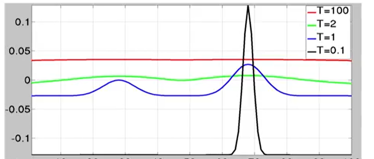

<!-- Notes Begin from here -->

We shall extensively be using the Baye's Rule, given below.
$$
P(H\vert e) = \frac{P(e\vert H)P(H)}{P(e)}
$$

|    Symbol     |  Meaning   |
| :-----------: | :--------: |
|      $H$      | Hypothesis |
|      $e$      |  Evidence  |
|    $P(H)$     |   Prior    |
|    $P(e)$     |  Marginal  |
| $P(e\vert H)$ | Likelihood |
| $P(H\vert e)$ | Posterior  |

Some of the applications of Baye's Rule are as follows:

1. Image Restoration - $P(\text{uncorrupted }\vert\text{ corrupted})$
2. Image Segmentation/Labeling - $P(\text{Label Image }\vert\text{ corrupted})$

*Classic Baye's Example with gaussian prior on unknown mean*

## Building Prior Models on Images

Let the dimensionality of the space be $N$ (voxel count). The following prior beliefs are generally valid on **uncorrupted** images.

- Image intensities/values are spatially (piecewise) smooth
- Discontinuities possible only at object boundaries 
- Number of objects $<<$ Number of pixels

&nbsp;

**Topological Space** - 

**Random Field** - 

**Neighbor**

**Clique** $C$ - $C$ contains a single site, or every pair of sites in $C$ are neighbors of each other. $C_i$ denotes the set of cliques of size $i$.

### Markov Random Field (MRF)

A random field with sites $S$ and neighborhood $N$ is an MRF when
$$
P(X_i\vert X_{S-\{i\}}) := P(X_i\vert X_{N_i})
$$
In words, the probability of a site can be computed using only its neighbors. This does **not** mean that $X_i$ and $X_j$ are independent if they are not neighbors.

{: .notice--info}

MRF is said to be **homogenous** if the functional form of $ P(X_i\vert X_{N_i})$ is independent of the position of site $i$ in the topological space. 

MRF allows us to model high dimensional $P(X)$ in terms of multiple low dimensional conditional probabilities. (9-dim when 8-neighbor system is used)

### Gibbs Random Field (GRF)

A random field is a GRF when the joint distribution equals the Gibbs Distribution.
$$
P(x) = \frac{1}{Z}\exp\left(-\frac{1}{T}U(x)\right)
$$

- $Z$ - *Partition Function*, normalization constant (depends on $T$ and $U$)
- $T$ - *Temperature*, constant (low $T$, sharp curve ; high $T$, flat curve) 
- $U(x)$ - Energy function

$$
U(x) = \sum_{c\in C}V_c(x_c)
$$

$C$ is the set of all cliques, $x_c$ is the set of image values in clique $c$, and $V_c$ is the clique potential function defined for the clique $c$.

**Homogenous** GRF has $V_c$ independent of the *location* of clique $c$

**Isotropic** GRF has $V_c$ independent of *spatial orientation* of clique $c$

$T$ has been used for a stochastic algorithm for optimization, called **simulated annealing**. (helps to get out of a local minima) Consider the problem of finding the global maximum for the blue curve above with an initial $T$ and initial solution $x$.

- Keeping $T$ constant
  - Sample $y$ from an isotropic/symmetric PDF in the vicinity of $x$
  - Update $x$ to $y$ with probability $\min \left[ P(y)/P(x)\right]$ 
- If $T<\text{(small positive number less than 1)}$, stop
- Else, reduce $T$ and repeat

&nbsp;

$X$ is an MRF on sites $S$ wrt neighborhood system $N$ **iff** $X$ is a GRF on $S$ wrt neighborhood system $N$. (They are equivalent!)

{: .notice--info}
