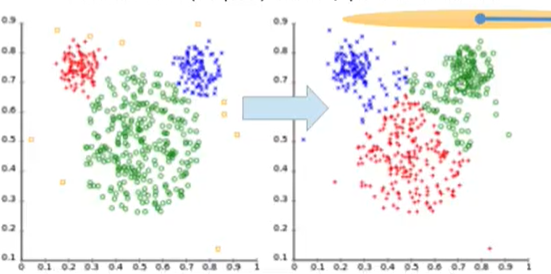
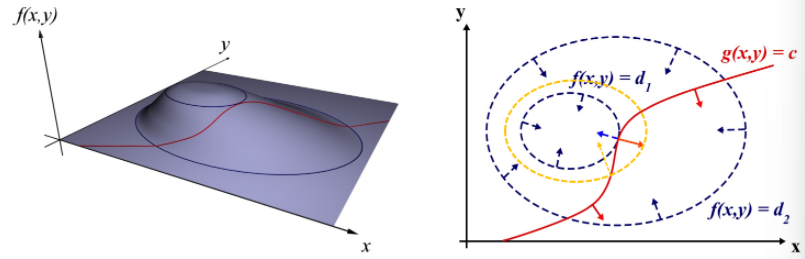

# Image Segmentation

Labeling each pixel/voxel to a specific class/cluster type. We will be looking at various clustering algorithms and analyze their performance and try to choose the best method.

&nbsp;

## K Means Clustering

Given the data points, we try to group the data into $k$ clusters. We will be looking at “hard” clustering, where each data point needs to be assigned to a single cluster. For the $i$‘th cluster, let the representative point be $\mu_i$. The optimization problem now becomes:

$$
\sum_{i=1}^k\sum_{x_j\in S_i}\vert\vert x_j-\mu_i \vert\vert^2
$$

A two step algorithm is employed for minimizing this objective function:

1. Keeping $\mu_i$ unchanged, we assign each point to the cluster with the closest representative point
2. Keeping the assignments unchanged, we shift $\mu_i$ to the mean of all the points in the cluster

This algorithm is guaranteed to converge, but a global optimum may not be obtained. Note that the problem is NP hard. Proper initialization of the initial $\mu_i$s is crucial to getting good clusters. 

### Farthest Point Clustering

Select the initial mean randomly from one of the given datapoints. Now, keep selecting the data point which is the farthest from all the previously chosen means. 

This initialization is very sensitive to outliers, and needs to be changed a little.

### K-Means++ Clustering

Instead of picking the farthest data point, we chose a point $x$ with a probability proportional to the least distance between $x$ and all the previously selected means. It can be proven that this method yields much better clustering than farthest point clustering.

However, this algorithm has its drawbacks as well. It tends to produce clusters with equal spreads, which doesn’t account for the clusters with different spreads from each other. Example, left clustering is what we want and the right is what we get.

## Silhouette Analysis

This is a method of analyzing the performance of clustering. It leads to a visualization of clustering quality.

For each data point $x_i$ assigned to cluster $A$, let $a_i$ be the average of distances between $x_i$ and all points in the same cluster. Similarly, let $b_i$ be the average of distances between $x_i$ and datapoints in a different cluster $B$.

Also define $s_i$ for each datum as follows. We want the value of $s_i$ to be large, preferably $>0.5$.

$$
s_i = \frac{(b_i - a_i)}{\max(a_i,b_i)}
$$

## Fuzzy C Means Algorithm

This method generalizes K Means clustering. Given data $\{y_i\}$, and number of clusters $K$, we define a new term called the “membership” of each datapoint $y_j$ to a cluster $k$ represented by $u_{jk}$. Membership has the following properties:

- $u_{jk}\geq0\quad \forall j,k$ 
- $\sum_k u_{jk} = 1$

The objective function to be minimized in this case is given by the following equation. $q>1$ is a parameter which controls the fuzziness of the clusters. 

$$
\sum_{j=1}^N\sum_{k=1}^K u^q_{jk}(y_j - c_k)^2
$$

The approach used for solving this optimization problem is **The method of Lagrange multipliers**. This approach is chosen because a non-linear type objective function ($f$) is being optimized using an equation ($g=c$) as a constraint. At the optimal point $(x^*, y^*)$, it can be seen that the gradients of both the functions are parallel (in the xy plane).

$$
\exists \lambda \text{ such that }\nabla_{x,y}f = -\lambda \nabla_{x,y} g
$$
Introduce a new function called the **Lagrangian**;

$$
L(x,y,\lambda) = f(x,y) + \lambda (g(x,y)-c)
$$
 

At the optimum, the partial derivatives wrt each of $x,y,\lambda$ must be 0. Therefore, we have three equations and three unknowns. These equations can be solved to get the optimum. For example, the Lagrangian for the FCM case would be given by:

$$
L(\{u_{jk}\}, \{c_k\}, \{\lambda_j\}) = \sum_{j=1}^N\sum_{k=1}^K u^q_{jk}(y_j - c_k)^2 + \lambda_j \left( \sum_k u_{jk} - 1 \right)
$$

#### Algorithm

1. Start with an initial estimate for the memberships

2. Fix the memberships and solve for the cluster means 

   The cluster means would be the weighted average of all points with their membership power $q$ as weights

3. Fix the cluster means and solve for memberships

   Use the above mentioned Lagrangian function to solve for the memberships

4. Repeat from step 2 

The memberships obtained in step 3 after solving the Lagrangian function would be:

$$
u_{jk} = \frac{\left(\frac{1}{d_{jk}}\right)^{\frac{1}{q-1}}}{\sum_k \left(\frac{1}{d_{jk}}\right)^{\frac{1}{q-1}}}
\qquad
d_{jk} := (y_j - c_k)^2
$$
