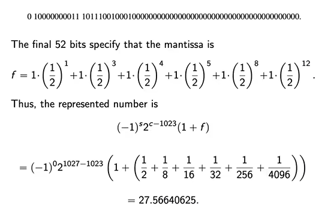

<!-- Notes Begin from here -->

Computers do not have memory to store infinitely many digits. This can lead to errors if not taken care of properly. For example, $\sqrt{3}$ is irrational and thus cannot be stored in a computer exactly. For most cases, we chose a rational number whose square is not exactly equal to 3 but is reasonably close to 3 to pass off without any problem. This may lead to **Round Off Errors**.

### Representing Real Numbers

64 bits are used to represent a number.

- The first bit is a **sign indicator**, denoted using $s$
- The next 11 bit exponent is called the **characteristic** $c$ 
- The remaining 52 bit fraction $f$ is called the **mantissa**

The final value of the exponent is given by $(c-1023)$ to ensure that negative exponents are allowed as well.
$$
\text{Number }= (-1)^s2^{c-1023}(1+f)
$$
$m$ has 52 bits, meaning that the precision of this method of representation is 16 digits.

{: .notice--info}

The smallest positive number that can be represented by this notation would be given by $(s,c,f) = (0,1,0)$. The number itself would be $2^{-1022} \approx 0.22251\times 10^{-307}$. Note that both $(0,0,0)$ and $(1,0,0)$ correspond to $0$. Numbers smaller than this result in **underflow**.

Similarly, the largest number would be $2^{1023}\cdot(2-2^{-52})$. Numbers larger than this result in **overflow**.

&nbsp;

## Floating Point Representation

We will use numbers of form
$$
\pm 0.d_1d_2\ldots d_k \times 10^n \qquad 1\leq d_1\leq9, 0\leq d_i\leq 9
$$
Converting a number $y$ which has more than $k$ decimal digits can be done in two ways;

- Chopping, wherein the additional digits are simply dropped
- Rounding, where we add $5\times10^{n-k'}$ and then drop the additional digits. $k'$ is the number of digits that $y$ has.

 Let $\rho$ be the real number and $\rho^*$ be the approximation.

|       Absolute Error        |             Relative Error             |
| :-------------------------: | :------------------------------------: |
| $\vert \rho - \rho^* \vert$ | $\frac{\vert \rho-\rho^* \vert}{\rho}$ |

&nbsp;

## Significant Digits

We say $\rho^*$ approximates $\rho$ to $t$ significant digits if $t$ is the largest non-negative integer for which
$$
\frac{\vert \rho-\rho^* \vert}{\rho} < 5\times 10^{-t}
$$
 

### Finite Digit Arithmetic

| Operation     | Meaning                 |
| ------------- | ----------------------- |
| $x\oplus y$   | $fl(fl(x)+fl(y))$       |
| $x \ominus y$ | $fl(fl(x)-fl(y))$       |
| $x \otimes y$ | $fl(fl(x)\times fl(y))$ |
| $x (\div) y$  | $fl(fl(x)\div fl(y))$   |

