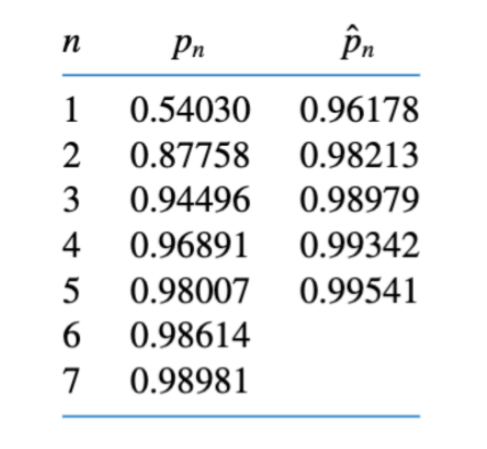

<!-- Notes Begin from here -->

This part of the course focuses on efficient ways of finding the roots of a given function. That is, given a function $f$ we are interested in finding $x$ such that the following equation is satisfied.

$$
f(x) = 0
$$

One of the most basic methods of finding roots of an equation would be the **bisection method**.

### Bisection Method

This method uses the intermediate value theorem, which states

> If $f:[a,b]\to\mathcal{R}$ is a continuous function with $f(a)\cdot f(b)<0$ then there exists $c\in[a,b]$ such that $f(c) = 0$

We “guess” the value of $c$ to be the midpoint of the current interval and check to see which of the halves the root lies by comparing signs of extremities.

Suppose that we wish to find the root with an error of $\epsilon$. The bisection method is continued until $\vert p_n - p_{n-1} \vert < \epsilon$. 

This method is very simple, but has a number of drawbacks. It is very slow to converge and a good intermediate approximation may get discarded at times. It is usually used at the start of approximation and more powerful methods are used after this.

&nbsp;

## Fixed Points

A fixed point of a function $f:[a,b]\to\mathcal{R}$ is a point $p$ such that $f(p)=p$. This problem can be converted to the root finding problem quite easily, and a number of theorems exist which make solving this problem a bit easier.

>  **Fixed Point Theorem**
>
> If $f:[a,b]\to[a,b]$ is continuous then $f$ has at least **ONE** fixed point.
>
> If additionally, $f'(x)$ exists on $(a,b)$ and $\vert f'(x) \vert\leq k<1$ for all $x\in(a,b)$ then $f$ has a **UNIQUE** fixed point in $[a,b]$.

### Fixed Point Iteration

This is a simple an easy technique for finding the fixed point of a function. Given a continuous function $f:[a,b]\to[a,b]$, we start with any $p_0\in[a,b]$ and generate a sequence $p_n = f(p_{n-1})$.

**IF** $\{p_n\}$ is a convergent sequence, then we can easily see that the sequence would converge to the fixed point of the function. However, we cannot guarantee the sequence’s convergence. Even if it is convergent, it is not guaranteed that the function would converge rapidly.

We shall look at ways to manipulate the root finding problem into the fixed point problem which satisfies the fixed point theorem as well.

### Newton Raphson Method

Given a **twice differentiable** function $f:[a,b]\to\mathcal{R}$, the 2-degree Taylor’s approximation of its root $p$ would be:

$$
0=f(p)=f(p_0)+(p-p_0)f'(p_0)+\frac{(p-p_0)^2}{2}f^"(\xi)
$$

If we assume that $p_0$ is close enough to the true root, we get the following iterative sequence.

$$
p_n = p_{n-1} - \frac{f(p_{n-1})}{f'(p_{n-1})}
$$

It can be tested out the this method is much better than the fixed point iteration method. However, it is important to remember the conditions upon which Newton-Raphson method works, $p_0$ is close enough and $f$ is twice differentiable.

> **Theorem**
>
> Let $f:[a,b]\to\mathcal{R}$ be twice differentiable.
>
> If $p\in[a,b]$ such that $f(p)=0$ and $f’(p)\neq 0$ then there exists a neighborhood around $p$ such that any sequence with its start in this neighborhood converges to $p$ via the Newton-Raphson method.

### Secant Method

Finding the value of $f’(p_n)$ at every step of the iteration is computationally intensive. We this approximate the value of the derivative in this method.

$$
p_n = p_{n-1} - f(p_{n-1})\left(\frac{p_{n-1}-p_{n-2}}{f(p_{n-1})-f(p_{n-2})}\right)
$$

This method obviously takes more time to converge than the Newton Raphson method but makes up for it in being less computationally intensive. 

### Regula Falsi Method (Method of False Position)

In both Newton Raphson and Secant methods, it is quite possible that all our estimates lie on a single side of the root, making it hard to ascertain how close to the root we are. This method is a slight modification to have an accurate bounds between which the root exists.

We first choose $p_0$ and $p_1$ such that $f(p_0)\cdot f(p_1)<0$. An approximation $p_2$ is made using the secant method. $p_2$ will lie on either side of the root. If $f(p_2)\cdot f(p_1)<0$ we carry on with the pair $(p_1, p_2)$. Otherwise, we carry on with the pair $(p_0, p_2)$.

Note that all these methods are slight modifications of the Newton Raphson method, and thus require the function to be double differentiable and the estimate to be close to the actual root.

&nbsp;

## Order of Convergence

Let $\{p_n\}$ be a sequence that converges to $p$ with $p_n\neq p$ for any $n$. We can say that the **order of convergence** of $\{p_n\}$ to $p$ is $\alpha$ with asymptomatic error $\lambda$ if:

$$
\lim_{n\to\infty}\frac{\vert p_{n+1} - p \vert}{\vert p_n - p \vert^\alpha}  = \lambda
$$

An iterative technique $p_n = g(p_{n-1})$ is said to be of order $\alpha$ if the sequence converges with order $\alpha$.

A sequence is said to be linearly convergent if $\alpha =1 $ **AND** $\lambda < 1$. Similarly, a sequence is said to be quadratically convergent if $\alpha=2$.

It can be seen quite easily from the Mean Value Theorem that Fixed Point Iteration converges *linearly* if $f’(p)\neq 0$. This implies that we need $f'(p)=0$ for higher order of convergence.
{: .notice--info}

> **Theorem**
>
> Let $p$ be a fixed point for the function $f$. Let $f’(p)=0$ and $f^"$ be continuous with $\vert  f^"(x)\vert < M $ where $x$ is nearby $p$. We can then state that there exists a neighborhood around $p$ where the sequence $p_n=f(p_{n-1})$ converges **at least quadratically**. For sufficiently large $n$,
>
> 
> $$
> \vert p_{n+1}-p_n \vert < \frac{M}{2}\vert p_n - p \vert^2
> $$

None of this matters for us because the Newton Raphson method and Secant method require $f’(p)\neq 0$. We thus try to come up with better methods to converge to fixed points faster.

### Multiplicity of a Zero

Let $g:[a,b]\to\mathcal{R}$ be a function with $p\in[a,b]$ being a root of $g$. We say that $p$ is a zero of multiplicity $m$ of $g$ if for $x\neq p$, we can write the following. $p$ is said to be a *Simple Zero*

 if $m=1$.
$$
g(x) = (x-p)^mq(x)
$$

Newton Raphson method works well when $g$ has a simple zero at $p$, however, it **may not** converge quadratically when the order of zero is greater than 1.
{: .notice--info}

&nbsp;

## Modified Newton Raphson Method

Given all the above problems that this method has, we modify it slightly. We shall try to modify $f$ to a new function $\mu$ such that $p$ is always its simple root. We can show that $\mu = f/f'$ works well for this case. Applying Newton Raphson to $\mu$ and simplifying, we get the following sequence;

$$
p_{n+1} = p_n - \frac{f(p_n)f'(p_n)}{f'(p_n)^2 - f(p_n)f^"(p_n)}
$$

This sequence is guaranteed to converge quadratically, but requires computing the double derivative as well which can be quite expensive.

### Aitken’s Method of Accelerating Convergence

Aitken’s $\Delta^2$ method involves computing a sequence in parallel to our original sequence with the following equation. An example has been given as well, which shows the convergence of $Cos(1/n)$. It can be seen that $\hat{p}$ converges faster to 1.

$$
\hat{p}_n = p_n - \frac{(p_{n+1}-p_n)^2}{p_{n+2}-2p_{n+1}+p_n}
$$

