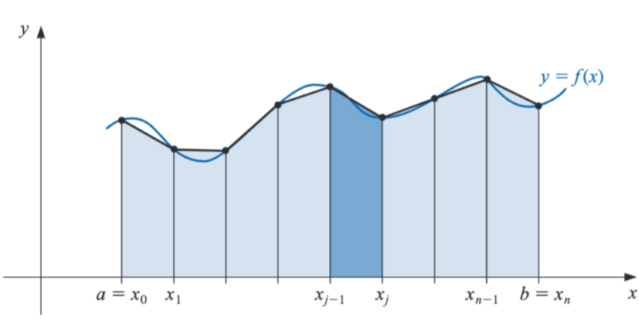
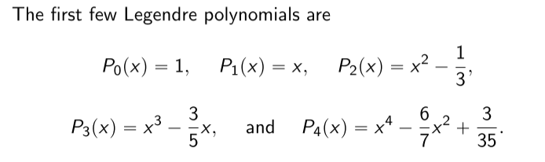
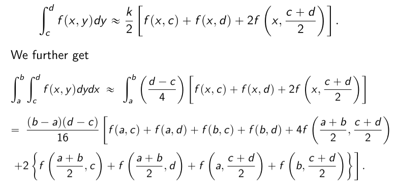
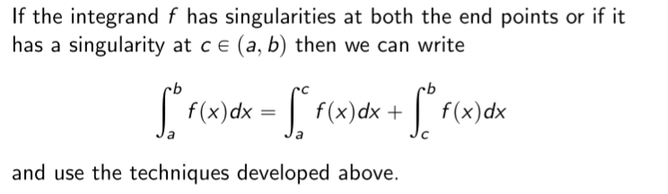

<!-- Notes Begin from here -->

Newton Cotes methods are unreliable because they use equally spaced nodes, and this may not be efficient for higher degree polynomials which have huge variations. Instead, we can simple apply lower degree Newton-Cotes methods to consecutive sets of points and achieve better results.

#### Composite Trapezoidal Rule

$$
\int_a^bf(x)dx \approx \frac{h}{2}\left[ f(a) + 2\sum_{j=1}^{n-1}f(x_j) + f(b) \right] + (\text{error term})
$$

### Stability of Composite Rules

{: .notice--info}
All composite rules are **STABLE**!

That is, the round-off error does not depend upon the number of computations performed. Recall that this was not the case for differentiation methods. The however have the same drawback as the Newton-Cotes methods wherein the nodes are equally spaced. This will be addressed in the next method.

&nbsp;

# Adaptive Quadrature Method

The step size is modified by predicting the function variation at a given $x$, to keep the error below a specified bound $\epsilon$. The analysis for only the Simpson’s method was performed, although it can be extended to other methods as well. Note that the error in Simpson’s method is $\mathcal{O}(h^5)$

The below condition ensures that $S(a,b)$ will have an error of $\epsilon$. If the condition is not met, we simply divide the interval $(a,b)$ into two and try to achieve an error of $\epsilon/2$ on each of the subintervals. 

$$
\vert S(a,b) - S(a,(a+b)/2) - S((a+b)/2,b)\vert < 15\epsilon
$$

This algorithm terminates _usually_ (not always).

## Gaussian Quadrature

We try to choose points to be **optimal** mathematically to reduce the error, rather than choosing them to be equally spaced. That is, the parameters are chosen such that the method has the largest degree of precision.

$$
\int_a^bf(x)dx = \sum_{i=1}^n c_if(x_i)
$$

We have $2n$ parameters that need to be chosen, meaning that the largest polynomial that can be approximated is of degree $2n-1$. There are two main methods:

#### 1. Special Cases

Work with the special cases of $2n-1$ degree polynomial $(1,x,\ldots,x^{2n-1})$ and solve the coefficient equations.

#### 2. Legendre Polynomials

Note that this method works when the domain of integration is $[-1,1]$. Legendre Polynomials of degree $n$ $(P_n)$ have two main characteristics:

- They are monic
- $\int_{-1}^1 P_n(x) P(x) = 0$ when degree of $P < n$

Importantly, the values of $x_1,\ldots x_m$ are given exactly by the roots of $P_n$.

$$
c_i =\int_{-1}^1\prod_{j=1}^n\frac{x-x_j}{x_i-x_j}dx
$$
&nbsp;

### Multiple Integrals

$$
\int\int f(x,y) dy dx = \int \left(\int f(x,y) dy\right) dx
$$

That is, simply apply the techniques learnt so far to the inner integral, and then apply it again for each term obtained for the outer integral computation!

&nbsp;

# Improper Integrals

$$
\int_a^b \frac{1}{(x-a)^p}\text{ converges IFF }0<p<1
$$

#### Singularity at a single end point

Consider the following integral, and let the numerator $g(x)$ be $n+1$ times continuously differentiable.

$$
\begin{align*}
\int_a^b\frac{g(x)}{(x-a)^p}dx = \int_a^b \frac{g(x)-P_n(x)}{(x-a)^p}dx + \int_a^b\frac{P_n(x)}{(x-a)^p}dx
\end{align*}
$$

The second term in the RHS can be evaluated easily. The first term is evaluated defining the fraction to be zero when $x\to a$, and simply using the techniques mentioned above (such as the composite Simpson’s rule).

**Infinite Limits** are handled by using the substitution $t=x^{-1}$ and using the techniques mentioned above.