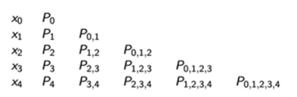
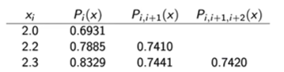
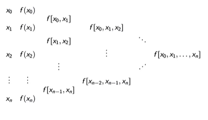
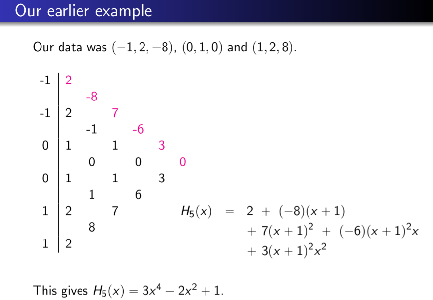

<!-- Notes Begin from here -->

We will be focusing on interpolation using polynomial functions.

$$
P(x) = a_nx^n+a_{n-1}x^{n-1}+\ldots+a_0
$$

Given any continuous function $f:[a,b]\rightarrow\mathcal{R}$, there exists a polynomial that is as “close” to the given function as desired. This is called as the **Weierstrass Approximation Theorem**.
{: .notice–info}

One natural choice would be to use the polynomial obtained from the Taylor’s theorem. However, note that these polynomials approximate the function **only at a given point**. It is not guaranteed that the Taylor’s polynomials at higher degree would offer higher a better approximation. (Works for $e^x$ but not for $1/x$)

## Lagrange Interpolating Polynomials

Let $x_0, x_1, \ldots x_n$ be distinct $(n+1)$ points and let $f$ be a function with $f(x_i)=y_i$. We would like to find a polynomial $P$ such that $P(x_i)=y_i$

Define $L_{n,i}(x_j) = \delta_{i,j}$ where $\delta_{i,j}$ is $1$ iff $i=j$ and $0$ otherwise. We can define $L_{n,i}(x)$ as follows:

$$
L_{n,i}(x) = \frac{(x-x_0)(x-x_1)\ldots(x-x_{i-1})(x-x_{i+1})\ldots(x-x_n)}{(x_i-x_0)(x_i-x_1)\ldots(x_i-x_{i-1})(x_i-x_{i+1})\ldots(x_i-x_n)}
$$

Now that this term has been defined, we can easily write the interpolation function as:

$$
P(x) = y_0L_{n,0}(x)+y_1L_{n,1}(x)+\ldots+y_nL_{n,n}(x)
$$

We can say that a unique interpolation polynomial of degree $\leq n$ exists for a given set of $n+1$ points.

### Error of interpolation

Let $f:[a,b]\rightarrow \mathcal{R}$ be $(n+1)$ differentiable, and $P(x)$ be the interpolating polynomial given $(n+1)$ distinct points $x_0, x_1\ldots x_n$ where $x_i\in[a,b]$.

For each $x\in[a,b]$ there exists a $\xi (x)\in(a,b)$ such that

$$
f(x) = P(x) + \frac{f^{(n+1)}(\xi(x))}{(n+1)!}(x-x_0)(x-x_1)\ldots(x-x_n)
$$

### Neville’s Formula - Cumulative Computation

We would like to have a method in which the lower degree polynomials help in computing the higher degree interpolating polynomial. Consider the nodes $\{x_0, \ldots x_n\}$ with $Q_i(x)$ being the interpolation of all points except $x_i$ and $Q_j(x)$ being the interpolation over all points except $x_j$. The interpolation over the entire set of nodes is given by:

$$
P(x) = \frac{(x-x_j)Q_j(x) - (x-x_i)Q_i(x)}{x_i-x_j}
$$

This lets us build the interpolating polynomial from the ground up, one degree at a time. Let $P_{i,j,k,\ldots}$ denote the interpolating polynomial obtained from the $i$‘th, $j$’th, $k$‘th and so on points, we can see that:

If we only care about the value of the interpolated polynomial, we don’t even need to calculate the polynomial itself; we can just replace $x$ in Neville’s formula with the required value. The value of $x$ here is $2.1$.

### Divided Differences

This is another method of constructing the interpolated polynomial. Given $(n+1)$ nodes $x_0, x_1, \ldots x_n$, we can define a new function $f[x_0, x_1, \ldots x_n]$ which is the coefficient of $x^n$ in the interpolating polynomial. Note that the function is independent of the order of nodes.

We shall now try to construct a recursive relation over $f$. Let $P_{n-1}$ be the polynomial over $\{x_0, x_1\ldots x_{n-1}\}$ and $Q_{n-1}$ be the polynomial over $\{x_1, x_2\ldots x_n\}$. From Neville’s formula we can get the following:

$$
\begin{align*}
	P_n(x) &= \frac{(x-x_n)P_{n-1} - (x-x_0)Q_{n-1}}{x_0-x_n} \\
	f[x_0,\ldots,x_n] &= \frac{f[x_0,\ldots,x_{n-1}] - f[x_1,\ldots,x_{n}]}{x_0 - x_n}
\end{align*}
$$

We know that for $x_i\in\{x_0,\ldots x_{n-1}\}, P_n(x_i)=P_{n-1}(x_i)$, by definition of the interpolating polynomial. Therefore, $P_n - P_{n-1}$ is equal to $0$ at the aforementioned $n$ points.

$$
\begin{align*}
P_n - P_{n-1} &= \alpha(x-x_0)(\ldots)(x-x_{n-1}) \\
&= f[x_0, \ldots, x_{n}](x-x_0)(\ldots)(x-x_{n-1}) \\
\implies P_n &= P_{n-1} + f[x_0, \ldots, x_{n}](x-x_0)(\ldots)(x-x_{n-1}) \\ 
\end{align*}
$$

We can pre-compute the divided differences using the modified Neville’s formula and then use the above recursive formula to get the interpolating polynomial function recursively.

$$
\begin{align*}
P_n &= f(x_0) + f[x_0,x_1](x-x_0) + f[x_0,x_1,x_2](x-x_0)(x-x_1)+\ldots \\
&= f(x_0) + (x-x_0)\left[ f[x_0,x_1] + (x-x_1)[f[x_0,x_1,x_2] + (x-x_2)[\ldots]]  \right]\\
\end{align*}
$$

Writing the recurrence relation in the nested form allows for efficient computation.

### Newton’s Difference as a function

> **Theorem**
>
> If $f$ is $n$-times continuously differentiable on $[a,b]$ then
>
>
> $$
> f[x_0, \ldots, x_n] = \frac{f^{(n)}(\xi)}{n!}
> $$
>
>
> for some $\xi\in[a,b]$

We would like to extend newton’s difference to be a function. From the modified Neville’s formula, we get that

$$
f[x_0, x] = \frac{f(x_0) - f(x)}{x_0 - x} \quad \text{where }x\neq x_0
$$

From the above theorem (extended MVT) and applying $\lim_{x\to x_0}$ we get the following base case for the function:

$$
f[x_0, x] = 
\begin{cases}
\frac{f(x_0) - x}{x_0 - x} & x\neq x_0 
\qquad \text{ base case}\\
f'(x_0) & x = x_0
\end{cases}
$$

We can now extend this base case to get the general function as shown in the below equation. Note that we would have to take care when there is equality between the nodes. **Divided differences function is continuous by induction**.

$$
f[x_0, \ldots, x_{n-1}, x] = f[x_0,\ldots,x,x_{n-1} ] = \frac{f[x_0,\ldots,x_{n-2}, x] - f[x_1, \ldots, x_{n-1}, x]}{x_0 - x_{n-1}}
$$

&nbsp;

## Hermite Polynomials

Given data points $x_0, x_1 \ldots x_n$ we wish to find an interpolating polynomial ($H_{2n+1}$) such that both the function values and the derivatives of the interpolating polynomial equals the actual function.

Define $H_i(x)$ and $\hat{H}_i(x)$ as follows, note that $L$ corresponds to the Lagrangian polynomial;

$$
\begin{align*}
	H_i(x) &= [1-2(x-x_i)L_i'(x_i)]L_i^2(x) \\
	\hat{H}_i(x) &= (x-x_i)L_i^2(x) \\
	\implies H_{2n+1}(x) &= \sum_i f(x_i)H_i(x) + \sum_i f'(x_i)\hat{H}_i(x) \\
\end{align*}
$$
 

The error for such an interpolation has a similar form to that of the normal interpolation, and is given below;

$$
f(x) = H_{2n+1}(x) + \frac{(x-x_0)^2(x-x_1)^2\ldots(x-x_n)^2}{(2n+2)!}f^{(2n+2)}(\xi(x)) \qquad \forall x-in[a,b], \xi(x)\in(a,b)
$$

Note that $H_{2n+1}$ can be computed using the Divided differences function that was defined by us earlier. Define a new set $Z = \{ z_0, z_1\ldots z_{2n+1} \}$ where $z_{2t} = x_t$ and $z_{2t+1} = z_{2t}$. It can be thus computed using the following formula similar to the one used for computing $P$;

$$
H_{2n+1}(x) = f[z_0] + \sum_{i=1}^{2n+1} f[z_0,\ldots z_i](x-x_0)\ldots(x-x_{i-1})
$$

&nbsp;

## Splines

Our methods for finding the interpolating polynomial fail because the order of the polynomial depends upon the number of datapoints, and a large degree polynomial usually is a bad idea as it is very sensitive to outliers. 

Splines use a piecewise polynomial function instead to estimate the function $f(x)$, and tend to be more accurate and representative of the underlying function.

A **cubic spline** is the most simplest case because we have four equations that need to be satisfied, and a cubic equation has four variables that can be adjusted. The following constraints need to be satisfied for a given set of data points $\{x_0, x_1, \ldots x_n \}$;

1. $S_j(x)$ is a polynomial defined on each $[x_j, x_{j+1}]$
2. $S_j(x_j) = f(x_j)$ and $S_j(x_{j+1}) = f(x_{j+1})$ 
3. $S_j'(x_{j+1}) = S_{j+1}'(x_{j+1})$ and $S_j''(x_{j+1}) = S_{j+1}''(x_{j+1})$

Moreover, there are two kinds of boundary conditions that may be imposed. Clamped boundary conditions are usually the better option, but natural boundaries are usually used because the derivative information is not available.

1. Natural or Free boundary:  $S''(x_0) = S''(x_n) = 0$
2. Clamped Boundary: $S'(x_0) = f'(x_0)$ and $S'(x_n) = f'(x_n)$

The cubic equation for the interval $[x_i, x_{i+1}]$ is usually written in the following manner;

$$
S_i(x) = a_i + b_i(x-x_i) + c_i(x-x_i)^2 + d_i(x-x_i)^3
$$

The **error** for clamped boundary condition is given by the following equation. The error for clamped is of the fourth order as well, but is more difficult to express because the clamped case is more prone to errors.

$$
\vert f(x)-S(x) \vert \leq \frac{5M}{384}\max_j(x_{j+1}-x_j)^4 \qquad M=\max_{a\leq x\leq b}\vert f^{(4)}(x)\vert
$$

