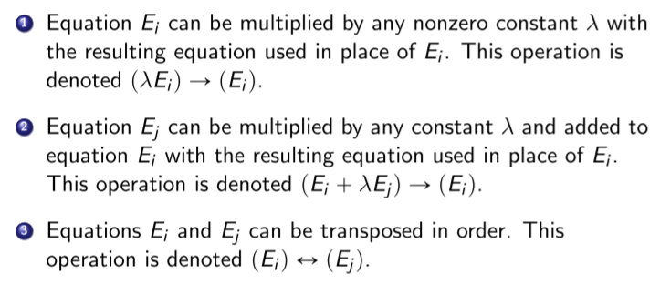

<!-- Notes Begin from here -->

We will be looking at solving the system of linear equations given by $A\cdot x = b$. We already know a unique solution exists if $A$ is invertible, and there are either infinitely many solutions or no solution exists if $A^{-1}$ doesn’t exist.

> #### Cramer’s Rule
>
> $$
> x_j = \frac{\text{det }A_j}{\text{det }A}
> $$
>
> Here, $A_j$ is the $j$‘th column of  $A$ being replaced by $b$.

We will be focusing on another method for finding the roots  for the given system of linear equations.

&nbsp;

## Gauss Elimination Method (GEM)

“Simplify” the given system of linear equations, and convert $A$ into an upper triangular matrix for easier computations. There are three transformations that can be performed.

Particularly, we perform the following sequence of operations iteratively for $i=2,\ldots (n-1)$ 

$$
(E_j - (a_{ji}/a_{ii})E_i)\to(E_j)
$$

If $a_{ii}$ is zero, then find $a_{ki}\neq0,k>i$ and interchange the $k$‘th and $i$’th rows. If no such $a_{ki}$ can be found, then a unique solution for the system of linear equations does not exist. Once the upper triangular matrix is obtained, we can simply solve the system of linear equations by back-substituting from $x_n$.

#### Operations Performed

We count addition/subtraction together and multiplication/divisions together. For performing the operation $(E_j - (a_{ji}/a_{ii})E_i)\to(E_j)$, we would need to perform:

- $(n-i)$ divisions + $(n-i)(n-i+1)$ multiplications
- $(n-i)(n-i+1)$ subtractions

After the upper triangular matrix is obtained, the $i$th equation would be solved using:

- $1$ division + $(n-i)$ multiplications
- $1$ subtraction + $(n-i-1)$ additions

Adding both these results and summing it up over $i$, we get that the number of operations required is of order $\mathcal{O(n^3/3)}$.

### Scaled Partial Pivoting

$a_{ii}$ is called as the “Pivot” for the $i$th linear equation, as it divides the result on the RHS during back-substitution. If the pivot is very small, it can lead to errors caused due to finite digit arithmetic. Scaled Partial Pivoting is used to try and prevent such errors from taking place.

**Scaling Factors** $(s_p)$ are computed for the $p$th rows at the very start as follows:

$$
s_p = \max_{1\leq j\leq n}\vert a_{ij} \vert
$$

Now suppose that we are at the $i$th step of GEM. We select the smallest integer $p\geq i$ such that

$$
p = \text{arg}\max_{i\leq k\leq n} \frac{\vert a_{ki} \vert}{s_k} \implies (E_i)\longleftrightarrow(E_p), \text{ } s_i\longleftrightarrow s_p
$$

and then we interchange the $i$th and the $p$th rows. Note that the scaling factors would be interchanged as well.

#### Operations Performed

Computing the scaling factors requires $n(n-1)$ comparisons at the start. For the $i$th row we would need to perform $(n-i+1)$ divisions, and $(n-i)$ comparisons. Notice that summation over $i$ would lead to both the terms being $\mathcal{O}(n^2)$ meaning that the computation cost is not large for performing Scaled Partial Pivoting.

&nbsp;

## LU Decomposition

We’ve seen the steps used to solve a system of linear equations, and the steps used to factor the matrix $A$. It would be very useful if we can factor the matrix as $A = LU$ where $L$ and $U$ are lower and upper triangular matrices respectively. 

Assume that no row exchanges are needed in solving a system of equations $A\cdot x=b$ using GEM. The first step would be given by the replacement $(E_j-m_{j1}E_1)\to(E_j)$ where $M_{j1} = a_{j1}/a_{11}$. We define a matrix called $M^{(1)}$ which does the exact same thing upon **left multiplication**.

$$
M^{(1)} = \begin{pmatrix}
1 & 0 & 0 & \cdots & 0 \\
-m_{21} & 1 & 0 & \cdots & 0 \\
-m_{31} & 0 & 1 & \cdots & 0 \\
\vdots  &   &   & \ddots & 0 \\
-m_{n1} & 0 & 0 & \cdots & 1
\end{pmatrix}
$$

Similarly, we define $M^{(i)}$ for the $i$th step of GEM. The method can thus be given by the following equation. 

$$
\begin{align*}
M^{(n-1)}\dots M^{(1)}Ax &= M^{(n-1)}\dots M^{(1)} b \\
A^{(n)}x &= b^{(n)}
\end{align*}
$$

Note that $A^{(n)}$ is an upper triangular matrix, and is the $U$ in the factorization that we wish to achieve. Moreover, every $M^{(k)}$ is a lower triangular matrix and its inverse can be used to regain the original matrix $A$ (and can also be easily computed). Therefore, the factorization would be given by:

$$
\begin{align*}
A = LU &= \left( L^{(1)}L^{(2)}\ldots L^{(n-1)} \right)\left( M^{(n-1)}M^{(n-2)}\ldots L^{(1)} A\right) \\
L^{(k)} &= \left( M^{(k)} \right)^{-1}
\end{align*}
$$

Once the factorization is obtained we solve the system of equations in these two steps:

1. Let $y=Ux$. Solve for $y$ in $Ly=b$.
2. Once $y$ is obtained, solve for $x$ in $Ux=y$

### Easing Row Interchange Constraint - PLU Decomposition

A permutation matrix $P$ is used to interchange the rows as needed. For an invertible matrix $A$, there exists a  permutation matrix $P$ such that $PAx=Pb$ does not require any permutations. Therefore, the decomposition would be given by

$$
A = P^{-1}LU = P'LU
$$

To get the permutation matrix $P$, simply perform row exchanges on the identity matrix. Similarly to get the inverse $P'$, perform column exchanges.

## Special Matrices

We discuss a few special matrices which do **NOT** require permutations for performing GEM (and subsequently in the LU Decomposition).

### Strictly Diagonally Dominant Matrices

An $n\times n$ matrix $A$ is said to be diagonally dominant iff the following condition is satisfied:

$$
\vert 2a_{ii} \vert \geq \sum_{j=1}^n\vert a_{ij} \vert
$$

It is said to be Strictly Diagonally Dominant if the inequality is strict. Strictly Diagonally Dominant matrices are invertible, need no $P$ in GEM, and are stable with respect to the growth of round-off errors.

### Positive Definite Matrices

A matrix $A$ is said to be PD if it is **symmetric** and for all $x\neq 0$, $x^TAx > 0$. Upon expanding this condition, we get the following. 

$$
\left( \sum_{i=1}^n\sum_{j=1}^n x_ia_{ij}x_j \right) > 0
$$

This condition cannot always be used to prove/disprove if $A$ is PD. Following are necessary conditions that are used to **disprove** $A$ being PD. (They are necessary, but not sufficient)

- $A$ must be invertible
- $a_{ii}>0$ for all $i$
- $a_{ii}a_{jj} > (a_{ij})^2$
- $\displaystyle \max_{1\leq k,j\leq n}\vert a_{kj} \vert \leq \max_{1\leq i\leq n}\vert a_{ii} \vert$

> A matrix $A$ is PD **if and only if** every leading principal submatrix of $A$ has a positive determinant. 

#### Cholesky Factorization

A matrix $A$ is PD **if and only if** $A=LL^T$ where $L$ is a lower triangular matrix. This is called a Cholesky Factorization.