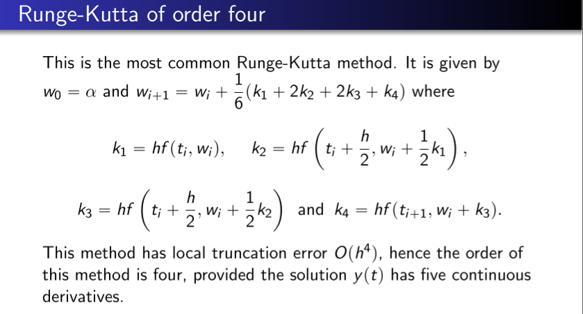

<!-- Notes Begin from here -->

We say that an initial valued problem is **well-posed** if it has a unique solution, and the initial value problem obtained by small perturbations also has a unique solution. Initial value problems are of the following form.

$$
\frac{dy}{dt} = f(t,y),\quad a\leq t\leq b\quad y(a)=\alpha
$$

There should exist a unique solution $y(t)$ to both this, and to the perturbed initial value problem $z(t)$.

### Lipschitz Condition

$f(t,y)$ is said to satisfy the Lipschitz condition in $y$ on a set $D\subset \mathcal{R}^2$ if a Lipschitz constant $L>0$ exists such that
$$
\vert f(t,y_1)-f(t,y_2)\vert \leq L\vert y_1-y_2 \vert
$$
whenever $(t,y_1), (t,y_2)\in D$.

> Let $D=\{ (t,y) a\leq t\leq b, -\infty < y < \infty \}$. The initial value problem described above is well-posed IFF $f(t,y)$ is continuous and satisfies the Lipschitz condition.

## Euler’s Method

Given the value of $y(a)=\alpha$, we wish to find the value of $y$ at $t=b$. This is done by dividing the interval into $N$ equal intervals, and iteratively finding the value of $y$ at each of this intervals. The following update rule is used, and is obtained via the Taylor’s theorem.

$$
w_{i+1} = w_i + h\cdot f(t_i,w_i) \qquad w_i\approx y(t_i)
$$

Note that Euler’s method is stable as well, that is the error grows not worse than linearly. Moreover, the following relation can be computed where $\vert y''(t) \vert \leq M$.

$$
\vert y(t_i)-w_i \vert \leq \frac{hM}{2L}\left[ e^{L(t_i-a)}-1 \right]
$$

Note that rounding error is not considered here. The error obtained will not be linear if it is considered.

## Local Truncation Error

At a given step $i$, the local truncation error $\tau_i$ is defined as the difference between actual and estimated values of $y(t_i)$. If the update rule is $z_{i+1} = z_i + h\phi(t_i,y_i)$, $\tau_{i+1}$ is defined as follows:

$$
\tau_{i+1}(h) = \frac{y_{i+1} - z_{i+1}}{h} = \frac{y_{i+1} - y_i}{h} - \phi(t_i,y_i)
$$

## Taylor Method of Order n

The update equation is obtained by using the Taylor’s expansion with $n$ order. Therefore, the update equation would be given by:

$$
w_{i+1} = w_i + h\left[ f(t_i,w_i) + \frac{h}{2} f'(t_i,w_i) + \ldots +\frac{h^{n-1}}{n!}f^{(n-1)}(t_i,w_i) \right]
$$

The error in the above example would be $\mathcal{O}(h^n)$. The higher derivatives can be computed by differentiating the ODE given in the initial value problem. This is computationally intensive however, so we look at the Runge-Kutta methods to ease computations required.

## Runge-Kutta Methods of Order 2

We first write the two dimensional $n$‘th Taylor polynomial for the function $f(t,y)$ about $(t_0, y_0)$.

$$
\begin{align*}
f(t,y) = &f(t_0,y_0) + \left[ (t-t_0)\frac{\partial f}{\partial t} + (y-y_0)\frac{\partial f}{\partial y} \right] + \\
&\frac{1}{2!}\left[ (t-t_0)^2\frac{\partial^2 f}{\partial t^2} + {}^2C_0(t-t_0)(y-y_0)\frac{\partial^2f}{\partial t\partial y} + (y-y_0)^2\frac{\partial^2 f}{\partial y^2} \right] + \ldots\\
\end{align*}
$$

To get the Runge-Kutta method, we want to approximate the Order 2 Taylor Method’s update function $T(t,y)$ with $a_1f(t+\alpha_1,y+\beta_1)$ within an error of $\mathcal{O}(h^2)$.

$$
\begin{align*}
T(t,y) &= f(t,y) + \frac{h}{2}f'(t,y) \\
&= f(t,y) + \frac{h}{2}\frac{\partial f}{\partial t} + \frac{hf}{2} \frac{\partial f}{\partial y} \\
f(t+\alpha_1,y+\beta_1) &= f(t,y) + \alpha_1\frac{\partial f}{\partial t} + \beta_1 \frac{\partial f}{\partial y} + R_2
\end{align*}
$$

Therefore, by comparing the coefficients we get that $a_1 = 1, \alpha_1=h/2, \beta_1=hf/2$. The simplified update equation for the Runge-Kutta Method of second order would thus be the following. This is called the **Midpoint Method**.

$$
w_{i+1} = w_i + hf\left( t_i+\frac{h}{2},y_i+\frac{h}{2}f(t_i,y_i) \right)
$$
 

We can redefine the approximating function to be $a_1f(t,w) + a_2f(t+\alpha_2,y+\delta_2f(t,y))$ so that it contains 4 parameters instead of 3. This approximation can still only approximate with error $\mathcal{O}(h^2)$ however. We can obtain the **Modified Euler Method** using this approximation.

#### Modified Euler Method

$$
w_{i+1} = w_i + \frac{h}{2}[f(t_i,w_i) + f(t_{i+1},w_i+hf(t_i,w_i))]
$$

&nbsp;

## Higher order Runge-Kutta Methods

## Error Control

Similar to our error analysis in integration techniques, we try to change the step size to ensure that the expected error is below a determined threshold. Let $w_i$ be the estimate using an $n$-order method, and $\tilde{w_i}$ be an estimate using an $n+1$-order method. Let the step size be $qh$ where $q$ is the parameter to be optimized. 

$$
\tau_{i}(qh)\leq\epsilon \implies q\leq\left(\frac{\epsilon h}{\vert \tilde{w_i} - w_i \vert}\right)^{1/n}
$$

That is, we have to compute the next iteration’s estimates, change $q$ appropriately, and THEN use this $q$ to compute the actual estimate. Instead of this, what we do is:

- If $q<1$; reject computations and re-compute using $qh$
- If $q\geq 1$; accept the computations but change $h$ to $qh$ for the next iteration

&nbsp;

# Multi-Step Methods

The methods used so far are said to be **Single Step Methods** because only the previous mesh point is used to estimate $w_i$. On the otherhand, the update equation for an $m$-step method would be:

$$
\begin{align*}
w_{i+1} = &a_{m-1}w_i + a_{m-2}w_{i-1} + \ldots a_0w_{i+1-m} \\
&h[b_mf(t_{i+1}, w_{i+1}) + b_{m-1}f(t_i, w_i) + \ldots b_0f(t_{i+1-m,w_{i+1-m}})]
\end{align*}
$$

The method is said to be **implicit** if $b_m\neq0$ and **explicit** if $b_m = 0$.

### Predictor-Corrector Method

Implicit methods are harder to compute, but yield better results. Explicit methods are easier to compute, but yield bad results. We first use the explicit method to compute a rudimentary estimate $w^p_{i+1}$ and then substitute this in the RHS of the implicit update equation instead of $f(t_{i+1}, w^p_{i+1})$.

&nbsp;

### Consistency

A method is said to be consistent if the maximum local truncation error at all the $N$ points tends to 0 as $h$ tends to 0.

$$
\lim_{h\to 0}\max_{1\leq i\leq N}\vert\tau_i(h)\vert = 0
$$

### Convergence

A method is said to be convergent if the maximum error at all the $N$ points tends to 0 as $h$ tends to 0.

$$
\lim_{h\to 0}\max_{1\leq i\leq N}\vert y(t_i) - w_i \vert = 0
$$

It can be seen from the error equation mentioned above that the Euler’s method is convergent.

> #### Theorem
>
> Consider the following one-step difference method:
>
> $$
> w_{i+1} = w_i + h\phi(t_i,w_i,h)
> $$
>
> Also let a $h_0>0$ exist such that $\phi$ is continuous and satisfies the Lipschitz condition over the set $D = \{ (t,w,h):a\leq t\leq b,-\infty<w<\infty, 0\leq h\leq h_0\}$.
>
> If the above conditions are satisfied, then:
>
> 1. The method is stable
> 2. The method is convergent **if and only if** the method is consistent
> 3. $\vert y(t_i) - w_i \vert \leq\frac{\tau(h)}{L}e^{L(t_i-a)}$